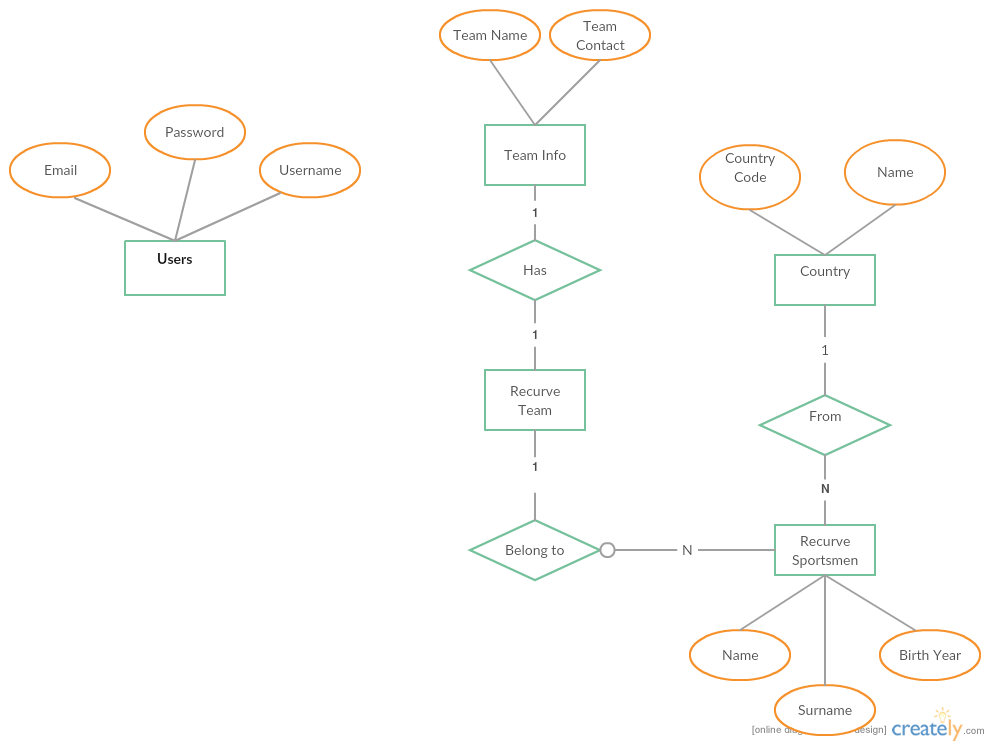

Parts Implemented by Emre Can Bulut
===================================

Entity Relationship Diagram
---------------------------

      Entity Relationship Diagram

*Countries* Table
-----------------
As seen in the E-R diagram above, users, team info, recurve team, recurve sportsmen, and countries tables are implemented. Before continuing with anything else,
it will be better to indicate that the countries table is hard coded as shown below.

.. code-block:: python

     #create countries table
     query = """ DROP TABLE IF EXISTS COUNTRIES """
     cursor.execute(query)
     query = """CREATE TABLE countries (
         id serial PRIMARY KEY,
         country_code character varying(2) NOT NULL,
         name character varying(64) NOT NULL
         )"""
     cursor.execute(query)
     #insert countries
     query = """
     INSERT INTO countries VALUES (1, 'AF', 'Afghanistan');
     INSERT INTO countries VALUES (2, 'AL', 'Albania');
     INSERT INTO countries VALUES (3, 'DZ', 'Algeria');
     INSERT INTO countries VALUES (4, 'AS', 'American Samoa');
     INSERT INTO countries VALUES (5, 'AD', 'Andorra');
     .
     .
     .

The reason why it is hard coded is quite simple. A country is not created or demolished so often. So, there was no reason to let users or admins of the website do
operations on countries table.

User System
-----------
The user system was actually planned to have a relation with the rest of the website. However, these plans are not realized.
So, as it can be deduced from the E-R diagram, the user has no relation with the rest of the system.

*Users* Table
^^^^^^^^^^^^^
+-----------------+-------------------+--------------+
| Name            | Type              | Restrictions |
+=================+===================+==============+
| ID              | serial            | Primary key  |
+-----------------+-------------------+--------------+
| email           | character varying |              |
+-----------------+-------------------+--------------+
| password        | character varying |              |
+-----------------+-------------------+--------------+
| username        | character varying |              |
+-----------------+-------------------+--------------+
| secret_question | character varying |              |
+-----------------+-------------------+--------------+
| secret_answer   | character varying |              |
+-----------------+-------------------+--------------+

Below code is written in the *initialize_database()* function.

.. code-block:: python

        #create users table
        query = """ DROP TABLE IF EXISTS USERS """
        cursor.execute(query)

        query = """CREATE TABLE users (
            id serial PRIMARY KEY,
            email character varying(50) NOT NULL,
            password character varying(20) NOT NULL,
            username character varying(25) NOT NULL,
            secret_question character varying(50),
            secret_answer character varying(50)
            )"""
        cursor.execute(query)

First, we drop the table if it exists. Then, the table with the attributes specified is created.

Registration
^^^^^^^^^^^^
Registration is where the user information needs to be added to the database if appropriate. Before we proceed to insert the given information
to the database, some controls must be done as shown below.

.. code-block:: python

            statement="""SELECT * FROM Users WHERE (USERNAME=%s)"""
            cursor.execute(statement, (inputUsername,))
            users=cursor.fetchone()
            if users is not None:
                registerMessage="Sorry, this username is already taken."
                anyError=1
                return
            inputEmail=request.form['email']
            statement="""SELECT * FROM Users WHERE (EMAIL=%s)"""
            cursor.execute(statement, (inputEmail,))
            users=cursor.fetchone()
            if users is not None:
                registerMessage="This email address is already registered."
                anyError=1
                return

After that, it is okay to add the user to the system.

.. code-block:: python

            statement="""INSERT INTO Users (username, email, password,
                                          secret_question, secret_answer)
                                                VALUES(%s, %s, %s, %s, %s)"""
            cursor.execute(statement, (inputUsername, inputEmail, inputPassword,
                                                     secretQuestion, secretAnswer))
            connection.commit()
            cursor.close()

Sign in
^^^^^^^
A user login is nothing but checking if the information given by the visitor matches with a tuple in the table. In order to do that, below query is written.

.. code-block:: python

            inputEmail=request.form['email']
            inputPassword=request.form['password']
            statement="""SELECT * FROM Users WHERE (EMAIL=%s) AND (PASSWORD=%s)"""
            cursor.execute(statement, (inputEmail, inputPassword))
            users=cursor.fetchone()
            if users is None:
               return render_template('sign_in.html', current_time=now.ctime(),
                                                message="Wrong email or password!")
            else:
               session['username']=users[3]
               return redirect(url_for('my_profile_page'))

If the information supplied matches a tuple in the database, then we keep the username in a session. When the user opens the website in another page while logged in,
he will be logged in on the newly opened page too. This is implemented by using session variables.

My Profile
^^^^^^^^^^
The user is redirected to his profile page where he can change his login information.

.. code-block:: python

             statement="""SELECT * FROM Users WHERE (username=%s) AND (password=%s)"""
             cursor.execute(statement, (session['username'], inputPassword))
             myUser=cursor.fetchone()
             if myUser is None:
                 errorMessage="Current password is wrong!"
                 return render_template('profile.html', Message=errorMessage,
                                 current_time=now.ctime(), a_username=session['username'])
             if inputEmail is not "":
                 statement="""UPDATE users SET (email)=(%s) WHERE (username=%s)"""
                 cursor.execute(statement,(inputEmail, session['username']))
                 check=True
             if inputnewPassword is not "":
                 statement="""UPDATE users SET (password)=(%s) WHERE (username=%s)"""
                 cursor.execute(statement,(inputnewPassword, session['username']))
                 check=True
             if check:
                 connection.commit()
                 successMessage="Your information has been updated successfully!"

The variable *check* is used so that the user could change either his email address or password or both at once.

Log Out
^^^^^^^
If the user forgets to close the web browser completely, he will be still logged in the system for a while. And, this can be abused by others.
To prevent this, a log out function is added which clears all the sessions and redirects to the home page.

.. code-block:: python

    @app.route('/clear')
    def clear_all_session():
    if 'username' in session:
        session.clear()
        session['ecb_message']="Logged out successfully!"
    else:
        session['ecb_message']="You are not logged in the system yet!"
    return redirect(url_for('home_page'))

Recurve Archers
---------------

*Recurve_sportsmen* Table
^^^^^^^^^^^^^^^^^^^^^^^^^
+------------+-------------------+--------------+
| Name       | Type              | Restrictions |
+============+===================+==============+
| ID         | serial            | Primary key  |
+------------+-------------------+--------------+
| name       | character varying |              |
+------------+-------------------+--------------+
| surname    | character varying |              |
+------------+-------------------+--------------+
| birth_year | integer           |              |
+------------+-------------------+--------------+
| country_id | integer           | Foreign key  |
+------------+-------------------+--------------+

The query to create the table specified above is as following.

.. code-block:: python

        query = """ DROP TABLE IF EXISTS RECURVE_SPORTSMEN """
        cursor.execute(query)

        #create recursive_sportsmen table
        query = """
        CREATE TABLE recurve_sportsmen (
        id serial PRIMARY KEY,
        name character varying(20) NOT NULL,
        surname character varying(30) NOT NULL,
        birth_year integer,
        country_id integer NOT NULL references countries(id)
        )"""
        cursor.execute(query)

Add or Update a Recurve Archer
^^^^^^^^^^^^^^^^^^^^^^^^^^^^^^

To add or update a recurve archer, the necessary and usual controls need to be done first. Then, the recurve archer is either added or updated if appropriate.

.. code-block:: python

            statement="""SELECT * FROM recurve_sportsmen WHERE (NAME=%s) AND (SURNAME=%s)"""
            cursor.execute(statement, (new_name, new_surname))
            recurver=cursor.fetchone()
            if 'recurver_to_update' in request.form:
                session['ecb_message']="Update successfull!"
                recurverID=request.form.get('recurver_to_update')
                statement="""UPDATE recurve_sportsmen SET (name, surname,
                                                      birth_year, country_id)=(%s, %s, %s, %s)
                                                      WHERE (ID=%s)"""
                cursor.execute(statement, (new_name, new_surname, new_birth_year,
                                                   new_country_id, recurverID))
                connection.commit()
            elif recurver is not None:
                session['ecb_message']="Sorry, this recurve sportsman already exists."
                cursor.close()
                connection.close()
                return redirect(url_for('recurve_page'))
            else: #try to insert
                statement="""INSERT INTO recurve_sportsmen (name, surname, birth_year,
                                                            country_id)
                                                            VALUES(%s, %s, %s, %s)"""
                cursor.execute(statement, (new_name, new_surname,
                                           new_birth_year, new_country_id))
                connection.commit()
          cursor.close()
          connection.close()
          return redirect(url_for('recurve_page'))

Any message that will be printed to the screen after a post back is kept in the session. Because, the rendering is done when the request method is *GET*.

Display All Archers or Search a Recurve Archer
^^^^^^^^^^^^^^^^^^^^^^^^^^^^^^^^^^^^^^^^^^^^^^
In order to display all the recurve archers or search a recurve archer (especially when the list is too long) the following code is written in the *recurve_page()* function.

.. code-block:: python

    with dbapi2.connect(app.config['dsn']) as connection:
        cursor=connection.cursor()
        if 'ecb_message' in session:
            messageToShow=session['ecb_message']
            session['ecb_message']=""
        else:
            messageToShow=""
    justSearch=False
    if 'search' in request.form:
        justSearch=True
    #display recurvers
    if request.method == 'GET' or justSearch:
        statement="""SELECT * FROM countries"""
        cursor.execute(statement)
        countries=cursor.fetchall()
        now = datetime.datetime.now()
        thisYear=datetime.datetime.today().year
        statement="""SELECT * FROM recurve_sportsmen"""
        cursor.execute(statement)
        allRecurvers=recurveCollection()
        for row in cursor:
            id, name, surname, birth_year, country_id = row
            allRecurvers.add_recurver(Recurver(id, name, surname, birth_year, country_id))
        foundRecurverCol=recurveCollection()
        if justSearch:
            st="""SELECT * FROM recurve_sportsmen WHERE ("""+request.form['filter_by']+"""=%s)"""
            searchText=request.form['text']
            if request.form['filter_by'] == "birth_year":
                searchText=datetime.datetime.today().year-int(request.form['text'])
            cursor.execute(st, (searchText,))
            for row in cursor:
                id, name, surname, birth_year, country_id = row
                foundRecurverCol.add_recurver(Recurver(id, name, surname,
                                                         birth_year, country_id))
        cursor.close()
        return render_template('recurve.html', recurvers=allRecurvers.get_recurvers(),
                  searchRecurvers=foundRecurverCol.get_recurvers(), allCountries=countries,
                  current_time=now.ctime(), rec_Message=messageToShow, current_year=thisYear)

The variable *justSearch* is used to check if there was a search request on the second table in the same page. If there is, there should be another query to the database.

Recurve Archery Teams
---------------------
Recurve archery teams is designed as 2 tables. These tables are shown below.

*Recurve_teams*

+-------------+---------+--------------+
| Name        | Type    | Restrictions |
+=============+=========+==============+
| ID          | serial  | Primary key  |
+-------------+---------+--------------+
| team_id     | integer | Foreign key  |
+-------------+---------+--------------+
| recurver_id | integer | Foreign key  |
+-------------+---------+--------------+

*Team_info*

+--------------+-------------------+--------------+
| Name         | Type              | Restrictions |
+==============+===================+==============+
| ID           | serial            | Primary key  |
+--------------+-------------------+--------------+
| team_name    | character varying |              |
+--------------+-------------------+--------------+
| team_contact | character varying |              |
+--------------+-------------------+--------------+

The reason why these two tables are seperated is to prevent anomalies. For example, if they were combined in one table, it would be waste of data space to store
the same team information for every player in the team. In order to keep referential integrity, *recurve_teams* table is created as following.

.. code-block:: python

      #create recurve_teams table
      query = """CREATE TABLE recurve_teams (
         id serial PRIMARY KEY,
         team_id integer NOT NULL references team_info(id) ON DELETE CASCADE ON UPDATE CASCADE,
         recurver_id integer NOT NULL references recurve_sportsmen(id) ON DELETE CASCADE ON UPDATE CASCADE
         )"""
      cursor.execute(query)

Display All Archery Teams
^^^^^^^^^^^^^^^^^^^^^^^^^
In order to display archery teams, we send the teams as *Recurve_team* objects as well as we send recurve archers as *Recurver* objects. The dropdown lists in the front end are bound with these data.

.. code-block:: python

            if request.method == 'GET':
            statement="""SELECT * FROM recurve_sportsmen"""
            cursor.execute(statement)
            allRecurvers=recurveCollection()
            for row in cursor:
                id, name, surname, birth_year, country_id = row
                allRecurvers.add_recurver(Recurver(id, name, surname, birth_year, country_id))
            statement="""SELECT * FROM team_info"""
            cursor.execute(statement)
            allTeams=recurveTeamCollection()
            for row in cursor:
                id, team_name, team_contact = row
                allTeams.add_team(Recurve_Team(id, team_name, team_contact))
            return render_template('recurve_teams.html', recurvers=allRecurvers.get_recurvers(),
                                      recTableMessage=messageToShow, teams=allTeams.get_teams())

And below code shows how the data is used in the dropdown lists.

.. code-block:: python

         <form id="form2" action="{{ url_for('recurve_teams_page') }}" method="post">
         <tr>

           <td><select class="form-control" name="dd_team_id" required>
              <option></option>
              
              <option value="{{team.id}}">{{team.team_name}}</option>
              
              </select></td>
           <td><select class="form-control" name="member_id" required>
              <option></option>
              
              <option value="{{recurver.id}}">{{recurver.name}} {{recurver.surname}}</option>
              
              </select></td>
         </tr>
         </table>
         <input type="submit" class="form-control" value="Add" name="insertMember">
         </form>^

Create a Recurve Team and Add Members
^^^^^^^^^^^^^^^^^^^^^^^^^^^^^^^^^^^^^
Creating a recurve team and adding members are implemented with the code below.

.. code-block:: python

       elif 'insertTeam' in request.form:
            team_name = request.form['inputTeamName']
            team_contact = request.form['inputContact']
            statement="""SELECT * FROM team_info WHERE (team_name=%s)"""
            cursor.execute(statement, (team_name,))
            teamWithSameName=cursor.fetchone()
            if teamWithSameName is not None:
                session['ecb_message']="Sorry, the team name is already taken."
                cursor.close()
                return redirect(url_for('recurve_teams_page'))
            else: #insert new team
                statement="""INSERT INTO team_info (team_name, team_contact) VALUES(%s, %s)"""
                cursor.execute(statement, (team_name, team_contact))
                connection.commit()
            return redirect(url_for('recurve_teams_page'))
        elif 'insertMember' in request.form:
            team_id=request.form['dd_team_id']
            member_id=request.form['member_id']
            statement="""SELECT count(*) FROM recurve_teams WHERE (team_id=%s)"""
            cursor.execute(statement, (team_id,))
            resultCount=cursor.fetchone()
            if resultCount[0] == 3: #team is full
                session['ecb_message']="Sorry, the team is full."
                cursor.close()
                return redirect(url_for('recurve_teams_page'))
            statement="""SELECT * FROM recurve_teams WHERE (recurver_id=%s)"""
            cursor.execute(statement, (member_id,))
            memberInTeam=cursor.fetchone()
            if memberInTeam is not None: #Recurver is in a team
                session['ecb_message']="Sorry, the recurve archer is already in a team."
                cursor.close()
            else: #insert
                statement="""INSERT INTO recurve_teams (team_id, recurver_id) VALUES(%s, %s)"""
                cursor.execute(statement, (team_id, member_id))
                connection.commit()
                session['ecb_message']="The recurve archer has joined to the team."
                cursor.close()
            return redirect(url_for('recurve_teams_page'))

If there are more than 1 tables on the same page, we do check which button was clicked by their names like 'insertMember' or 'insertTeam'.

Delete a Recurve Archery Team
^^^^^^^^^^^^^^^^^^^^^^^^^^^^^
Deleting a team is exactly same with how the recurve archers are deleted. The values of checkboxes are set to be the team ids.
By doing so, we can easily get the ids of the selected tuples in the back end.

.. code-block:: python

        elif 'teams_to_delete' in request.form:
            keys = request.form.getlist('teams_to_delete')
            for key in keys:
                statement="""DELETE FROM team_info WHERE (ID=%s)"""
                cursor.execute(statement, (key,))
            connection.commit()
            cursor.close()
            session['ecb_message']="Successfully deleted!"
            return redirect(url_for('recurve_teams_page'))

Display a Recurve Archery Team
^^^^^^^^^^^^^^^^^^^^^^^^^^^^^^

In order to display a specific team, the id of the team is sent to the following function.

.. code-block:: python

   @app.route('/recurve_team/<int:key>', methods=['GET', 'POST'])
   def recurve_team_page(key):
       with dbapi2.connect(app.config['dsn']) as connection:
     cursor=connection.cursor()
     cursor2=connection.cursor()
     if 'ecb_message' in session:
         messageToShow=session['ecb_message']
         session['ecb_message']=""
     else:
         messageToShow=""
     if request.method == 'GET':
         statement="""SELECT * FROM countries"""
         cursor.execute(statement)
         countries=cursor.fetchall()
         statement="""SELECT * FROM team_info WHERE (id=%s)"""
         cursor.execute(statement, (key,))
         catchInfo=cursor.fetchone()
         theTeam=Recurve_Team(catchInfo[0], catchInfo[1], catchInfo[2])
         thisYear = datetime.datetime.today().year
         statement="""SELECT * FROM recurve_teams WHERE (team_id=%s)"""
         cursor.execute(statement, (key,))
         recurversInTeam = recurveCollection()
         for row in cursor:
             id, team_id, recurver_id = row
             statement="""SELECT * FROM recurve_sportsmen WHERE (id=%s)"""
             cursor2.execute(statement, (recurver_id,))
             aRecurver=cursor2.fetchone()
             recurversInTeam.add_recurver(Recurver(aRecurver[0], aRecurver[1], aRecurver[2], aRecurver[3], aRecurver[4]))
         return render_template('recurve_team.html', recurvers=recurversInTeam.get_recurvers(),
                                 recTableMessage=messageToShow, team=theTeam, current_year=thisYear,
                                 allCountries=countries)