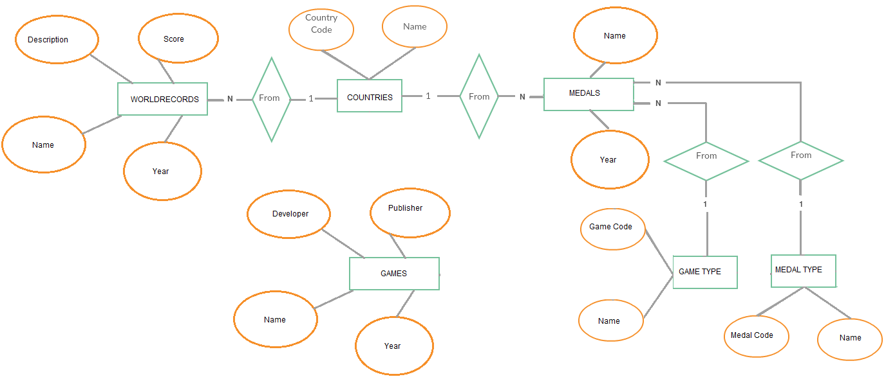

Parts Implemented by Ozan Ateş
==============================

      Figure: E/R Diagram for the parts implemented by Ozan Ateş

1. `World Records Page`_
2. `Olympic Medalists Page`_
3. `Video Games Page`_

World Records Page
------------------

Creating WORLDRECORDS table
+++++++++++++++++++++++++++

The table named **WORLDRECORDS** is created for World Records Page. This table has following attribute structure:

+-------------+-------------------+---------------+------------------+
| Name        | Type              | References    | Additional info  |
+=============+===================+===============+==================+
| ID          | serial            |               | PRIMARY KEY      |
+-------------+-------------------+---------------+------------------+
| description | character varying |               | NOT NULL, UNIQUE |
+-------------+-------------------+---------------+------------------+
| score       | integer           |               |                  |
+-------------+-------------------+---------------+------------------+
| name        | character varying |               | NOT NULL         |
+-------------+-------------------+---------------+------------------+
| country_id  | integer           | countries(id) | NOT NULL         |
+-------------+-------------------+---------------+------------------+
| year        | integer           |               |                  |
+-------------+-------------------+---------------+------------------+

This table is created under the **initialize_database()** function in the **server.py** file.

.. code-block:: python

         query = """DROP TABLE IF EXISTS WORLDRECORDS"""
         cursor.execute(query)

         #initialize world records table (empty)
         query = """CREATE TABLE WORLDRECORDS (
            ID SERIAL PRIMARY KEY,
            description character varying(40) NOT NULL,
            score INTEGER,
            name character varying(20) NOT NULL,
            country_id integer NOT NULL references countries(id),
            year INTEGER,
            UNIQUE (description)
         )"""
         cursor.execute(query)

Handling the operations on the WORLDRECORDS table: worldrecords_page()
++++++++++++++++++++++++++++++++++++++++++++++++++++++++++++++++++++++

Handling add, delete, update, search operations on the **WORLDRECORDS** table and rendering related html page are developed under the **worldrecords_page()** function in the **server.py**file.
Source code of the **worldrecords_page()** function will be explained in this section.

In the beginning, necessary initializations are done.

.. code-block:: python

        with dbapi2.connect(app.config['dsn']) as connection:
           cursor=connection.cursor()
           if 'ecb_message' in session:
               messageToShow=session['ecb_message']
               session['ecb_message']=""
           else:
               messageToShow=""

* Database connection is done.
* Session is used for showing a message on html page.

.. code-block:: python

         now = datetime.datetime.now()

* The time is fetched from the system to show on html page.

.. code-block:: python

         justSearch=False
         if 'search' in request.form:
            justSearch=True

* Checked if search operation is needed in the request form.

.. code-block:: python

        if request.method == 'GET' or justSearch: #1
           q1="""SELECT * FROM countries"""
           cursor.execute(q1)
           countries=cursor.fetchall() #2
           query="""SELECT * FROM worldrecords""" #3
           cursor.execute(query)
           allWorldRecords=wrecordsCol() #4
           for row in cursor: #5
               id, description, score, name, country_id, year = row
               allWorldRecords.add_worldrecord(WorldRecord(id, description, score, name, country_id, year))
           foundWrecordsCol=wrecordsCol()
           if 'search' in request.form:
               statem="""SELECT * FROM worldrecords WHERE ("""+request.form['filter_by']+"""=%s)"""
               searchText=request.form['text']
               cursor.execute(statem, (searchText,)) #6
               for row in cursor: #7
                   id, description, score, name, country_id, year = row
                   foundWrecordsCol.add_worldrecord(WorldRecord(id, description, score, name, country_id, year))
           cursor.close() #8
           return render_template('worldrecords.html', worldrecords=allWorldRecords.get_worldrecords(),
                                  searchWorldrecords=foundWrecordsCol.get_worldrecords(), allCountries=countries,
                                  current_time=now.ctime(), rec_Message=messageToShow)

* #1: If request.method is *GET* or *search* operation is needed, web page for this table is needed to be rendered.
* #2: All countries are fetched from *COUNTRIES* table because *country_id* of the *WORLDRECORDS* table is referenced from *COUNTRIES* table.
* #3: All world records are fetched from *WORLDRECORDS* table.
* #4: A collection of world records is created and named as allWorldRecords. This collection will be used to collect data from table and send it to the rendering template.
* #5: Every world record in the *WORLDRECORDS* table is placed in the allWorldRecords collection.
* #6: Attribute name that is going to be filtered comes from the request form by the variable *filter_by*. Attribute value that is going to be searched comes from the request form by the variable *text*. If a search operation is needed, all world records that have the *filter_by* attribute with *text* value is selected.
* #7: All selected world records are placed into *foundWrecordsCol* collection.
* #8: Connection is closed and html page will be rendered.

.. code-block:: python

         elif 'worldrecords_to_delete' in request.form:
            keys = request.form.getlist('worldrecords_to_delete')
            for key in keys:
               statement="""DELETE FROM worldrecords WHERE (ID=%s)"""
               cursor.execute(statement, (key,))
            connection.commit()
            cursor.close()
            session['ecb_message']="Successfully deleted!"
            return redirect(url_for('worldrecords_page'))

* If delete operation is needed, related world record IDs are fetched from request form and related world records are deleted. Same page is returned with the message of success.

.. code-block:: python

         else: #1
                 new_description=request.form['description']
                 new_score=request.form['score']
                 new_name=request.form['name']
                 new_country_id=request.form['country_id']
                 new_year=request.form['year']
                 session['ecb_message']="Insertion successfull!"
                 try:
                     if int(new_year)>datetime.datetime.today().year: #2
                         session['ecb_message']="Sorry, the year you've entered is in the future. Did you come back from the future?"
                         cursor.close()
                         connection.close()
                         return redirect(url_for('worldrecords_page'))
                     #update
                     elif 'wrecord_to_update' in request.form: #3
                             session['ecb_message']="Update successfull!"
                             wrecordID=request.form.get('wrecord_to_update')
                             statement="""UPDATE worldrecords SET (description, score, name, country_id, year)=(%s, %s, %s, %s, %s) WHERE (ID=%s)"""
                             cursor.execute(statement, (new_description, new_score, new_name, new_country_id, new_year, wrecordID))
                             connection.commit()
                     else: #4
                         statement="""SELECT * FROM worldrecords WHERE description=%s"""
                         cursor.execute(statement, (new_description,))
                         worldrecord=cursor.fetchone()
                         if worldrecord is not None: #5
                             session['ecb_message']="Sorry, this record (description) already exists in the table."
                             cursor.close()
                             connection.close()
                             return redirect(url_for('worldrecords_page'))
                         #try to insert
                         else: #6
                             statement="""INSERT INTO worldrecords (description, score, name, country_id, year) VALUES(%s, %s, %s, %s, %s)"""
                             cursor.execute(statement, (new_description, new_score, new_name, new_country_id, new_year))
                             connection.commit()
                 except dbapi2.DatabaseError: #7
                     connection.rollback()
                     session['ecb_message']="Registration failed due to a Database Error."
             cursor.close()
             connection.close()
             return redirect(url_for('worldrecords_page')) #8

* #1: If listing, deleting or searching operation is not needed, add or update operation is needed to be done.
* #2: All new information are fetched from request form. If the information of year is in the future, error message is send to the session and no operation will be done.
* #3: If update operation is needed, related ID is fetched from the request form and the world record with that ID is updated according to new information.
* #4: Final possible operation is add operation.
* #5: If add operation is needed, we check if there is already a world record with the new description because we cannot add a new world record with duplicate description.
* #6: If there is no problem in the add operation, a world record with new information is added into the table.
* #7: Exception handling for a possible database error.
* #8: Connection is closed and same page is redirected.

Handling the World Records Page: worldrecords.html
++++++++++++++++++++++++++++++++++++++++++++++++++

World Records Page is rendered using **worldrecords.html** file. **games.css** file is used for handling style of text backgrounds and pictures.

* In this section, firstly, html file will be explained.

.. code-block:: html

      <!DOCTYPE html>
      <html>
        <head>
         <link href="{{ url_for('static', filename='tablestyle.css') }}" rel="stylesheet">
         <link href="{{ url_for('static', filename='games.css') }}" rel="stylesheet">

      

* CSS files and base page are introduced.

.. code-block:: html

      Archery: The World Records

* Title is named.

.. code-block:: html

      
      <body>

      <h1>Archery: The World Records</h1>
       
      <h4>This is the table of world records in archery.</h4>
      <h4>You can add a world record with related details here.</h4>
      <h4>Description of the record is what defines the record.</h4>

* Body of the html is introduced with the information about the page.

.. code-block:: html

      

      <table>
         <tr>
            <td></td>
            <td>Description</td>
            <td>Score</td>
            <td>Name</td>
            <td>Nationality</td>
            <td>Year</td>
            <td></td>
         </tr>
         <form action="{{ url_for('worldrecords_page') }}" method="post">
           
            <tr>
               <td><input type="checkbox" name="worldrecords_to_delete" value="{{worldrecord.id}}" /></td>
               <td> {{ worldrecord.description }} </td>
               <td> {{ worldrecord.score }} </td>
               <td> {{ worldrecord.name }} </td>
               <td> {{ allCountries[(worldrecord.country_id)-1][2] }} </td>
               <td> {{ worldrecord.year }} </td>
               <td><input type="radio" name="wrecord_to_update" value="{{worldrecord.id}}" form="form1"/></td>
            </tr>
         
            <tr>
               <td><input type="submit" class="form-control" value="Delete" name="delete"></td>
         </form>
         <form id="form1" action="{{ url_for('worldrecords_page') }}" method="post">
               <label for="inputDescription" class="sr-only">Description</label>
               <td><input type="text" id="inputDescription" name="description" class="myinput" placeholder="Description of the record" required autofocus></td>
               <label for="inputScore" class="sr-only">Score</label>
               <td><input type="text" id="inputScore" name="score" class="myinput" placeholder="Score of the record" required></td>
               <label for="inputName" class="sr-only">Name</label>
               <td><input type="text" id="inputName" name="name" class="myinput" placeholder="Name of the record holder" required></td>
               <td><select class="form-control" name="country_id" required>
                <option></option>
                
                <option value="{{allCountries[key-1][0]}}">{{allCountries[key-1][2]}}</option>
                  
                  </select></td>
               <td><input type="text" id="inputYear" name="year" class="myinput" placeholder="The year that record is set"/></td>
               <td><input type="submit" class="form-control" value="Update" name="update"></td>
            </tr>
            </table>
      <input type="submit" class="form-control" value="Add" name="insert">
      

* Table representation, text boxes for inputs, Add button for add operation, radio buttons and Update button for update operation, check boxes and Delete button for delete operation are created for the World Records page.

.. code-block:: html

      

      {{rec_Message}}
      

      </form>

* Related message comes from the earlier operation is shown if it exist.

.. code-block:: html

      
      

* One of the two image is shown on the page.
* An acrobatic archer as default, a scene from the movie Back to the Future for the error message.

.. code-block:: html

       
      <h2>Find World Records</h2>
       

      <form id="form3" action="{{ url_for('worldrecords_page') }}" method="post">
         

         <select class="myinput" name="filter_by">
               <option value="description"> Search by Description </option>
               <option value="score"> Search by Score </option>
               <option value="name"> Search by Name </option>
            </select>
            <label for="text" class="sr-only">Search</label>
         <input type="text" id="inputUsername" name="text" class="myinput" placeholder="enter the value to search">
          
         <input type="submit" class="myinput" value="SEARCH IT PLEASE" name="search">
          
         <h4>Here are the results:</h4>
         

      </form>
       

       <table>
         <tr>
           <td>Description</td>
         <td>Score</td>
         <td>Name</td>
         <td>Nationality</td>
         <td>Year</td>
         </tr>
         
         <tr>
           <td> {{ worldrecord.description }} </td>
         <td> {{ worldrecord.score }} </td>
         <td> {{ worldrecord.name }} </td>
         <td> {{ allCountries[(worldrecord.country_id)-1][2] }} </td>
         <td> {{ worldrecord.year }} </td>
         </tr>
         

       </table>
       

      

* Taking the inputs for the search operation and showing separate table for the results.

.. code-block:: css

      h1 {
         background-color: #a3a6cb;
      }

      h2 {
         background-color: #a3a6cb;
      }

      h4 {
         background-color: #d2d3e6;
      }

      img {
          display: block;
          margin: 0 auto;
          height: 400px;
          width: 600px;
      }

* CSS file for background colors of text and image properties.

Olympic Medalists Page
----------------------

Creating MEDALS table
+++++++++++++++++++++

The table named **MEDALS** is created for Olympic Medalists Page. This table has following attribute structure:

+--------------+-------------------+----------------+-----------------+
| Name         | Type              | References     | Additional info |
+==============+===================+================+=================+
| ID           | serial            |                | PRIMARY KEY     |
+--------------+-------------------+----------------+-----------------+
| name         | character varying |                | NOT NULL        |
+--------------+-------------------+----------------+-----------------+
| gameType_id  | integer           | gametypes(id)  | NOT NULL        |
+--------------+-------------------+----------------+-----------------+
| country_id   | integer           | countries(id)  | NOT NULL        |
+--------------+-------------------+----------------+-----------------+
| medalType_id | integer           | medalTypes(id) | NOT NULL        |
+--------------+-------------------+----------------+-----------------+
| year         | integer           |                |                 |
+--------------+-------------------+----------------+-----------------+

This table is created under the **initialize_database()** function in the **server.py** file.

.. code-block:: python

         query = """DROP TABLE IF EXISTS MEDALS"""
         cursor.execute(query)

         #initialize table (empty)
         query = """CREATE TABLE MEDALS (
            ID SERIAL PRIMARY KEY,
            name character varying(20) NOT NULL,
            gameType_id integer NOT NULL references gametypes(id),
            country_id integer NOT NULL references countries(id),
            medalType_id integer NOT NULL references medaltypes(id),
            year INTEGER
        )"""
        cursor.execute(query)

Handling the operations on the MEDALS table: medals_page()
++++++++++++++++++++++++++++++++++++++++++++++++++++++++++

Handling add, delete, update, search operations on the **medals** table and rendering related html page are developed under the **medals_page()** function in the **server.py**file.
Source code of the **medals_page()** function will be explained in this section.

In the beginning, necessary initializations are done.

.. code-block:: python

        with dbapi2.connect(app.config['dsn']) as connection:
           cursor=connection.cursor()
           if 'ecb_message' in session:
               messageToShow=session['ecb_message']
               session['ecb_message']=""
           else:
               messageToShow=""

* Database connection is done.
* Session is used for showing a message on html page.

.. code-block:: python

         now = datetime.datetime.now()

* The time is fetched from the system to show on html page.

.. code-block:: python

         justSearch=False
         if 'search' in request.form:
            justSearch=True

* Checked if search operation is needed in the request form.

.. code-block:: python

        if request.method == 'GET' or justSearch: #1
           q1="""SELECT * FROM countries"""
           cursor.execute(q1)
           countries=cursor.fetchall() #2
           q2="""SELECT * FROM GAMETYPES"""
           cursor.execute(q2)
           gametypes=cursor.fetchall() #2
           q3="""SELECT * FROM MEDALTYPES"""
           cursor.execute(q3)
           medaltypes=cursor.fetchall() #2
           query="""SELECT * FROM medals""" #3
           cursor.execute(query)
           allMedals=medalCol() #4
           for row in cursor: #5
               id, name, gameType_id, country_id, medalType_id, year = row
               allMedals.add_medal(Medal(id, name, gameType_id, country_id, medalType_id, year))
           foundMedalsCol=medalCol()
           if 'search' in request.form:
               statem="""SELECT * FROM medals WHERE ("""+request.form['filter_by']+"""=%s)"""
               searchText=request.form['text']
               cursor.execute(statem, (searchText,)) #6
               for row in cursor: #7
                   id, name, gameType_id, country_id, medalType_id, year = row
                   foundMedalsCol.add_medal(Medal(id, name, gameType_id, country_id, medalType_id, year))
           cursor.close() #8
           return render_template('medals.html', medals=allMedals.get_medals(),
                                  searchMedals=foundMedalsCol.get_medals(), allCountries=countries,
                                  allMedalTypes=medaltypes, allGameTypes=gametypes,
                                  current_time=now.ctime(), rec_Message=messageToShow)

* #1: If request.method is *GET* or *search* operation is needed, web page for this table is needed to be rendered.
* #2: All countries, game types and medal types are fetched from their tables because *country_id* , *gameType_id* and *medalType_id* of the *MEDALS* table is referenced from these tables.
* #3: All medals are fetched from *MEDALS* table.
* #4: A collection of medals is created and named as *allMedals*. This collection will be used to collect data from table and send it to the rendering template.
* #5: Every medal in the *MEDALS* table is placed in the *allMedals* collection.
* #6: Attribute name that is going to be filtered comes from the request form by the variable *filter_by*. Attribute value that is going to be searched comes from the request form by the variable *text*. If a search operation is needed, all medals that have the *filter_by* attribute with *text* value is selected.
* #7: All selected medals are placed into *allMedals* collection.
* #8: Connection is closed and html page will be rendered.

.. code-block:: python

         elif 'medals_to_delete' in request.form:
           keys = request.form.getlist('medals_to_delete')
           for key in keys:
               statement="""DELETE FROM medals WHERE (ID=%s)"""
               cursor.execute(statement, (key,))
           connection.commit()
           cursor.close()
           session['ecb_message']="Successfully deleted!"
           return redirect(url_for('medals_page'))

* If delete operation is needed, related medal IDs are fetched from request form and related medals are deleted. Same page is returned with the message of success.

.. code-block:: python

         else: #1
              new_name=request.form['name']
              new_gameType_id=request.form['gameType_id']
              new_country_id=request.form['country_id']
              new_medalType_id=request.form['medalType_id']
              new_year=request.form['year']
              session['ecb_message']="Insertion successfull!"
              try:
                  if int(new_year)>datetime.datetime.today().year: #2
                      session['ecb_message']="Sorry, the year you've entered is in the future. Did you come back from the future?"
                      cursor.close()
                      connection.close()
                      return redirect(url_for('medals_page'))
                  #update
                  elif 'medal_to_update' in request.form: #3
                          session['ecb_message']="Update successfull!"
                          medalID=request.form.get('medal_to_update')
                          statement="""UPDATE medals SET (name, gameType_id, country_id, medalType_id, year)=(%s, %s, %s, %s, %s) WHERE (ID=%s)"""
                          cursor.execute(statement, (new_name, new_gameType_id, new_country_id, new_medalType_id, new_year, medalID))
                          connection.commit()
                  #try to insert
                  else: #4
                      statement="""INSERT INTO medals (name, gameType_id, country_id, medalType_id, year) VALUES(%s, %s, %s, %s, %s)"""
                      cursor.execute(statement, (new_name, new_gameType_id, new_country_id, new_medalType_id, new_year))
                      connection.commit()
              except dbapi2.DatabaseError: #5
                  connection.rollback()
                  Message="Registration failed due to a Database Error."
          cursor.close()
          connection.close()
          return redirect(url_for('medals_page')) #6

* #1: If listing, deleting or searching operation is not needed, add or update operation is needed to be done.
* #2: All new information are fetched from request form. If the information of year is in the future, error message is send to the session and no operation will be done.
* #3: If update operation is needed, related ID is fetched from the request form and the medal with that ID is updated according to new information.
* #4: Final possible operation is add operation. A medal with new information is added into the table.
* #5: Exception handling for a possible database error.
* #6: Connection is closed and same page is redirected.

Handling the Olympic Medalists Page: medals.html
++++++++++++++++++++++++++++++++++++++++++++++++

Olympic Medalists Page is rendered using **medals.html** file. **games.css** file is used for handling style of text backgrounds and pictures.

* In this section, firstly, html file will be explained.

.. code-block:: html

      <!DOCTYPE html>
      <html>
        <head>
         <link href="{{ url_for('static', filename='tablestyle.css') }}" rel="stylesheet">
         <link href="{{ url_for('static', filename='games.css') }}" rel="stylesheet">

      

* CSS files and base page are introduced.

.. code-block:: html

      Olympic Medals in Archery

* Title is named.

.. code-block:: html

      
      <body>

      <h1>Olympic Medals in Archery</h1>
       
      <h4>This is the table of olympic medals in archery.</h4>
      <h4>You can add a medal with related details here.</h4>

* Body of the html is introduced with the information about the page.

.. code-block:: html

      

      <table>
         <tr>
            <td></td>
            <td>Name</td>
            <td>Nationality</td>
            <td>Game Type</td>
            <td>Medal Type</td>
            <td>Year</td>
            <td></td>
         </tr>
         <form action="{{ url_for('medals_page') }}" method="post">
           
            <tr>
               <td><input type="checkbox" name="medals_to_delete" value="{{medal.id}}" /></td>
               <td> {{ medal.name }} </td>
               <td> {{ allCountries[(medal.country_id)-1][2] }} </td>
               <td> {{ allGameTypes[(medal.gameType_id)-1][2] }} </td>
               <td> {{ allMedalTypes[(medal.medalType_id)-1][2] }} </td>
               <td> {{ medal.year }} </td>
               <td><input type="radio" name="medal_to_update" value="{{medal.id}}" form="form1"/></td>
            </tr>
         
            <tr>
               <td><input type="submit" class="form-control" value="Delete" name="delete"></td>
         </form>
         <form id="form1" action="{{ url_for('medals_page') }}" method="post">
               <label for="inputName" class="sr-only">Name</label>
               <td><input type="text" id="inputName" name="name" class="myinput" placeholder="Name of the medalist or team" required autofocus></td>

               <td><select class="form-control" name="country_id" required>
                <option></option>
                
                <option value="{{allCountries[key-1][0]}}">{{allCountries[key-1][2]}}</option>
                  
                  </select></td>

               <td><select class="form-control" name="gameType_id" required>
                <option></option>
                
                <option value="{{allGameTypes[key-1][0]}}">{{allGameTypes[key-1][2]}}</option>
                  
                  </select></td>

                  <td><select class="form-control" name="medalType_id" required>
                <option></option>
                
                <option value="{{allMedalTypes[key-1][0]}}">{{allMedalTypes[key-1][2]}}</option>
                  
                  </select></td>
               <td><input type="text" id="inputYear" name="year" class="myinput" placeholder="Year of the medal"/></td>
               <td><input type="submit" class="form-control" value="Update" name="update"></td>
            </tr>
            </table>
      <input type="submit" class="form-control" value="Add" name="insert">
      

* Table representation, text boxes for inputs, Add button for add operation, radio buttons and Update button for update operation, check boxes and Delete button for delete operation are created for the Olympic Medalists page.

.. code-block:: html

      

      {{rec_Message}}
      

      </form>

* Related message comes from the earlier operation is shown if it exist.

.. code-block:: html

      
      

* One of the two image is shown on the page.
* An acrobatic archer as default, a scene from the movie Back to the Future for the error message.

.. code-block:: html

       
      <h2>Find all medals of a person or a team</h2>
       

      <form id="form3" action="{{ url_for('medals_page') }}" method="post">
         

         <select class="myinput" name="filter_by">
               <option value="name"> Search by name of the medalist or team </option>
            </select>
            <label for="text" class="sr-only">Search</label>
         <input type="text" id="inputUsername" name="text" class="myinput" placeholder="enter the value to search">
          
         <input type="submit" class="myinput" value="SEARCH IT PLEASE" name="search">
          
         <h4>Here are the results:</h4>
         

      </form>
       

       <table>
         <tr>
           <td>Name</td>
         <td>Nationality</td>
         <td>Game Type</td>
         <td>Medal Type</td>
         <td>Year</td>
         </tr>
         
         <tr>
           <td> {{ medal.name }} </td>
         <td> {{ allCountries[(medal.country_id)-1][2] }} </td>
         <td> {{ allGameTypes[(medal.gameType_id)-1][2] }} </td>
         <td> {{ allMedalTypes[(medal.medalType_id)-1][2] }} </td>
         <td> {{ medal.year }} </td>
         </tr>
         

       </table>
       

   

* Taking the inputs for the search operation and showing separate table for the results.

.. code-block:: css

      h1 {
         background-color: #a3a6cb;
      }

      h2 {
         background-color: #a3a6cb;
      }

      h4 {
         background-color: #d2d3e6;
      }

      img {
          display: block;
          margin: 0 auto;
          height: 400px;
          width: 600px;
      }

* CSS file for background colors of text and image properties.

Video Games Page
----------------

Creating GAMES table
++++++++++++++++++++

The table named **GAMES** is created for Video Games Page. This table has following attribute structure:

+-----------+-------------------+------------+------------------+
| Name      | Type              | References | Additional info  |
+===========+===================+============+==================+
| ID        | serial            |            | PRIMARY KEY      |
+-----------+-------------------+------------+------------------+
| name      | character varying |            | NOT NULL, UNIQUE |
+-----------+-------------------+------------+------------------+
| developer | character varying |            |                  |
+-----------+-------------------+------------+------------------+
| publisher | character varying |            |                  |
+-----------+-------------------+------------+------------------+
| year      | integer           |            |                  |
+-----------+-------------------+------------+------------------+

This table is created under the **initialize_database()** function in the **server.py** file.

.. code-block:: python

         query = """DROP TABLE IF EXISTS GAMES"""
         cursor.execute(query)

         query = """CREATE TABLE GAMES (
            ID SERIAL PRIMARY KEY,
            name character varying(20) NOT NULL,
            developer character varying(30),
            publisher character varying(30),
            year INTEGER,
            UNIQUE (name)
        )"""
        cursor.execute(query)

Handling the operations on the GAMES table: games_page()
++++++++++++++++++++++++++++++++++++++++++++++++++++++++

Handling add, delete, update, search operations on the **GAMES** table and rendering related html page are developed under the **games_page()** function in the **server.py**file.
Source code of the **games_page()** function will be explained in this section.

In the beginning, necessary initializations are done.

.. code-block:: python

        with dbapi2.connect(app.config['dsn']) as connection:
           cursor=connection.cursor()
           if 'ecb_message' in session:
               messageToShow=session['ecb_message']
               session['ecb_message']=""
           else:
               messageToShow=""

* Database connection is done.
* Session is used for showing a message on html page.

.. code-block:: python

         now = datetime.datetime.now()

* The time is fetched from the system to show on html page.

.. code-block:: python

         justSearch=False
         if 'search' in request.form:
            justSearch=True

* Checked if search operation is needed in the request form.

.. code-block:: python

        if request.method == 'GET' or justSearch: #1
           query="""SELECT * FROM games""" #2
           cursor.execute(query)
           allGames=gameCol() #3
           for row in cursor: #4
               id, name, developer, publisher, year = row
               allGames.add_game(Game(id, name, developer, publisher, year))
           foundGameCol=gameCol()
           if 'search' in request.form:
               statem="""SELECT * FROM games WHERE ("""+request.form['filter_by']+"""=%s)"""
               searchText=request.form['text']
               cursor.execute(statem, (searchText,)) #5
               for row in cursor: #6
                   id, name, developer, publisher, year = row
                   foundGameCol.add_game(Game(id, name, developer, publisher, year))
           cursor.close() #7
           return render_template('games.html', games=allGames.get_games(),
                                  searchGames=foundGameCol.get_games(),
                                  current_time=now.ctime(), rec_Message=messageToShow)

* #1: If request.method is *GET* or *search* operation is needed, web page for this table is needed to be rendered.
* #2: All video games are fetched from *GAMES* table.
* #3: A collection of video games is created and named as *allGames*. This collection will be used to collect data from table and send it to the rendering template.
* #4: Every video game in the *GAMES* table is placed in the *allGames* collection.
* #5: Attribute name that is going to be filtered comes from the request form by the variable *filter_by*. Attribute value that is going to be searched comes from the request form by the variable *text*. If a search operation is needed, all video games that have the *filter_by* attribute with *text* value is selected.
* #6: All selected video games are placed into *allGames* collection.
* #7: Connection is closed and html page will be rendered.

.. code-block:: python

         elif 'games_to_delete' in request.form:
           keys = request.form.getlist('games_to_delete')
           for key in keys:
               statement="""DELETE FROM games WHERE (ID=%s)"""
               cursor.execute(statement, (key,))
           connection.commit()
           cursor.close()
           session['ecb_message']="Successfully deleted!"
           return redirect(url_for('games_page'))

* If delete operation is needed, related video game IDs are fetched from request form and related video games are deleted. Same page is returned with the message of success.

.. code-block:: python

         else: #1
           new_name=request.form['name']
           new_developer=request.form['developer']
           new_publisher=request.form['publisher']
           new_year=request.form['year']
           session['ecb_message']="Insertion successfull!"
           try:
               if int(new_year)>datetime.datetime.today().year: #2
                   session['ecb_message']="Sorry, this game has not been released yet."
                   cursor.close()
                   connection.close()
                   return redirect(url_for('games_page'))
               #update
               elif 'game_to_update' in request.form: #3
                   session['ecb_message']="Update successfull!"
                   gameID=request.form.get('game_to_update')
                   statement="""UPDATE games SET (name, developer, publisher, year)=(%s, %s, %s, %s) WHERE (ID=%s)"""
                   cursor.execute(statement, (new_name, new_developer, new_publisher, new_year, gameID))
                   connection.commit()
               else: #4
                   statement="""SELECT * FROM games WHERE NAME=%s"""
                   cursor.execute(statement, (new_name,))
                   game=cursor.fetchone()
                   if game is not None: #5
                       session['ecb_message']="Sorry, this game already exists."
                       cursor.close()
                       connection.close()
                       return redirect(url_for('games_page'))
                   #try to insert
                   else: #6
                       statement="""INSERT INTO games (name, developer, publisher, year) VALUES(%s, %s, %s, %s)"""
                       cursor.execute(statement, (new_name, new_developer, new_publisher, new_year))
                       connection.commit()
           except dbapi2.DatabaseError: #7
               connection.rollback()
               session['ecb_message']="Registration failed due to a Database Error."
       cursor.close()
       connection.close()
       return redirect(url_for('games_page')) #8

* #1: If listing, deleting or searching operation is not needed, add or update operation is needed to be done.
* #2: All new information are fetched from request form. If the information of year is in the future, error message is send to the session and no operation will be done.
* #3: If update operation is needed, related ID is fetched from the request form and the video game with that ID is updated according to new information.
* #4: Final possible operation is add operation.
* #5: If add operation is needed, we check if there is already a video game with the new name information that is gathered because we cannot add a new video game with duplicate name.
* #6: If there is no problem in the add operation, a video game with new information is added into the table.
* #7: Exception handling for a possible database error.
* #8: Connection is closed and same page is redirected.

Handling the Video Games Page: games.html
+++++++++++++++++++++++++++++++++++++++++

Video Games Page is rendered using **games.html** file. **games.css** file is used for handling style of text backgrounds and pictures.

* In this section, firstly, html file will be explained.

.. code-block:: html

      <!DOCTYPE html>
      <html>
        <head>
         <link href="{{ url_for('static', filename='tablestyle.css') }}" rel="stylesheet">
         <link href="{{ url_for('static', filename='games.css') }}" rel="stylesheet">

      

* CSS files and base page are introduced.

.. code-block:: html

      Video Games about Archery

* Title is named.

.. code-block:: html

      
      <body>

      <h1>Video Games about Archery</h1>
       
      <h4>This is the table of released video games about archery.</h4>
      <h4>You can add a new game with related details here.</h4>
      <h4>Adding an unreleased game is not allowed.</h4>

* Body of the html is introduced with the information about the page.

.. code-block:: html

      

      <table>
         <tr>
            <td></td>
            <td>Name</td>
            <td>Developer</td>
            <td>Publisher</td>
            <td>Release year</td>
            <td></td>
         </tr>
         <form action="{{ url_for('games_page') }}" method="post">
           
            <tr>
               <td><input type="checkbox" name="games_to_delete" value="{{game.id}}" /></td>
               <td> {{ game.name }} </td>
               <td> {{ game.developer }} </td>
               <td> {{ game.publisher }} </td>
               <td> {{ game.year }} </td>
               <td><input type="radio" name="game_to_update" value="{{game.id}}" form="form1"/></td>
            </tr>
         
            <tr>
               <td><input type="submit" class="form-control" value="Delete" name="delete"></td>
         </form>
         <form id="form1" action="{{ url_for('games_page') }}" method="post">
               <label for="inputName" class="sr-only">Name</label>
               <td><input type="text" id="inputName" name="name" class="myinput" placeholder="Name of the game" required autofocus></td>

               <label for="inputDeveloper" class="sr-only">Developer</label>
               <td><input type="text" id="inputDeveloper" name="developer" class="myinput" placeholder="Developer of the game" required/></td>

               <label for="inputPublisher" class="sr-only">Publisher</label>
               <td><input type="text" id="inputPublisher" name="publisher" class="myinput" placeholder="Publisher of the game" required/></td>

               <td><input type="text" id="inputYear" name="year" class="myinput" placeholder="Release year"/></td>
               <td><input type="submit" class="form-control" value="Update" name="update"></td>
            </tr>
            </table>
      <input type="submit" class="form-control" value="Add" name="insert">
      

* Table representation, text boxes for inputs, Add button for add operation, radio buttons and Update button for update operation, check boxes and Delete button for delete operation are created for the Video Games page.

.. code-block:: html

      

      {{rec_Message}}
      

      </form>

* Related message comes from the earlier operation is shown if it exist.

.. code-block:: html

      
      

* One of the two image is shown on the page.
* An acrobatic archer as default, a scene from the movie Back to the Future for the error message.

.. code-block:: html

       
      <h2>Find Games</h2>
       
      <form id="form3" action="{{ url_for('games_page') }}" method="post">
         

         <select class="myinput" name="filter_by">
               <option value="name"> Search by Name </option>
               <option value="developer"> Search by Developer </option>
               <option value="publisher"> Search by Publisher </option>
               <option value="year"> Search by Release Year </option>
            </select>
            <label for="text" class="sr-only">Search</label>
         <input type="text" id="inputUsername" name="text" class="myinput" placeholder="enter the value to search">
          
         <input type="submit" class="myinput" value="SEARCH IT PLEASE" name="search">
          
         <h4>Here are the results:</h4>
         

      </form>
       

       <table>
         <tr>
           <td>Name</td>
         <td>Developer</td>
         <td>Publisher</td>
         <td>Release year</td>
         </tr>
         
         <tr>
           <td> {{ game.name }} </td>
               <td> {{ game.developer }} </td>
               <td> {{ game.publisher }} </td>
               <td> {{ game.year }} </td>
         </tr>
         

       </table>
       

       

* Taking the inputs for the search operation and showing separate table for the results.

.. code-block:: css

      h1 {
         background-color: #a3a6cb;
      }

      h2 {
         background-color: #a3a6cb;
      }

      h4 {
         background-color: #d2d3e6;
      }

      img {
          display: block;
          margin: 0 auto;
          height: 400px;
          width: 600px;
      }

* CSS file for background colors of text and image properties.