Parts Implemented by Muhammet Afşin Karataş
===========================================

Mounted Sportsmen Table
-----------------------

Creating
^^^^^^^^

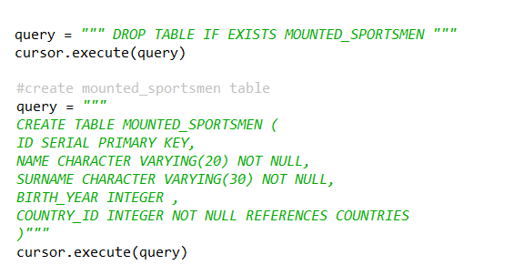

      Fig. 1: Creating the mounted sportsmen table

In initialize_database function first if the table exists we drop it and than we create the table as new.

Display and Search
^^^^^^^^^^^^^^^^^^

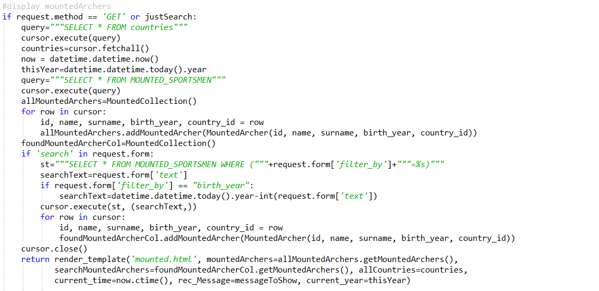

      Fig. 2: display and search for mounted sportsmen table

If the operation is search or we are just displaying information from the database the code above is run.

For displaying we get all the information fro the table with the """SELECT * FROM MOUNTED_SPORTSMEN""" query. And we go through all rows with a loop and send the information to the page.

For searching we use the following query """SELECT * FROM MOUNTED_SPORTSMEN WHERE ("""+request.form['filter_by']+"""=%s)""". This query select all of the information for the the filter we choose. Then we send the selected information to the page.

Delete
^^^^^^

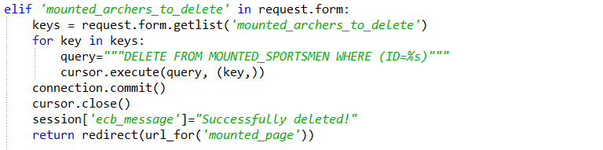

      Fig. 3: delete operation codes for mounted sportsmen table

If any checkbox (for delete operation) is selected in the form we go through the database and delete the selected rows with the following query """DELETE FROM MOUNTED_SPORTSMEN WHERE (ID=%s)""". %s is the key we took from the form. Then we redirect to mounted archery page.

Insert and Update
^^^^^^^^^^^^^^^^^

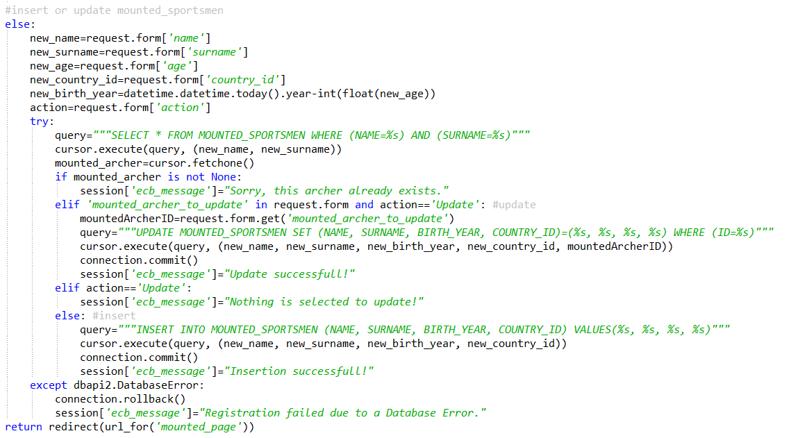

      Fig. 4: insert and update codes for mounted sportsmen table

First we get all of the information from the input tags in the html. Then we try to update or insert.

We look if the there is a person with the same name and surname in the table. If there is we change the error message and end. If not we continue for the update control. If update is requested we use """UPDATE MOUNTED_SPORTSMEN SET (NAME, SURNAME, BIRTH_YEAR, COUNTRY_ID)=(%s, %s, %s, %s) WHERE (ID=%s)""" query to update the old data. If none of the radio button is selected but update button is clicked we give an error message says "Nothing is selected to update!".

If no update requested that mean it is an insert request. So we insert the data with """INSERT INTO MOUNTED_SPORTSMEN (NAME, SURNAME, BIRTH_YEAR, COUNTRY_ID) VALUES(%s, %s, %s, %s)""" query.

Then we have rhe exception handler for database originated errors.
At the end we redirect to the mounted archery page.

Tournament Table
----------------

Creating
^^^^^^^^

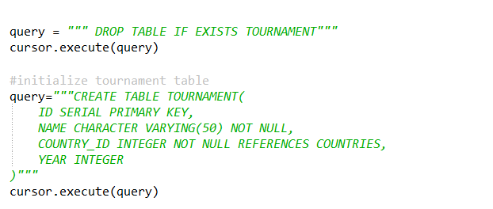

      Fig. 5: Creating the tournament table

In initialize_database function first if the table exists we drop it and than we create the table as new.

Display
^^^^^^^

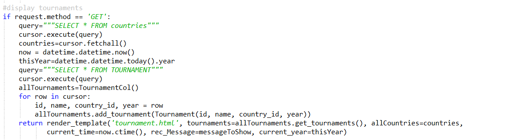

      Fig. 6: display for tournament table

To display the information we get the infromation from countries and tournament tables with the select queries. Then we create the objects for each row. Then this object are sent to the page.

Delete
^^^^^^

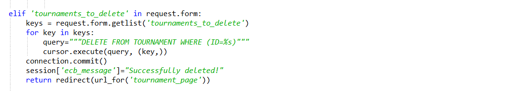

      Fig. 7: delete operation codes for tournament table

If any checkbox (for delete operation) is selected in the form we go through the database and delete the selected rows with the following query """DELETE FROM TOURNAMENT WHERE (ID=%s)""". %s is the key we took from the form. Then we redirect to the tournaments page.

Insert and Update
^^^^^^^^^^^^^^^^^

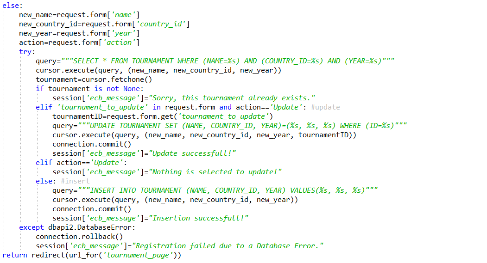

      Fig. 8: insert and update codes for tournament table

First we star with getting the information from the html input tags. Then we look if the tournament already exists in the tournament table with the """SELECT * FROM TOURNAMENT WHERE (NAME=%s) AND (COUNTRY_ID=%s) AND (YEAR=%s)""" query. If it exists we change the error message to "Sorry, this tournament already exists.".

If it doesn't exists we look for if it is an update request or not. If there is an update request in the form we update the selected row with """UPDATE TOURNAMENT SET (NAME, COUNTRY_ID, YEAR)=(%s, %s, %s) WHERE (ID=%s)""" query.

If no update request that means it is an insert request. Then we insert with the """INSERT INTO TOURNAMENT (NAME, COUNTRY_ID, YEAR) VALUES(%s, %s, %s)""" query.

The messages are updated in all cases. Then we have the exception handler for the database originated errors. At the end we redirect to the tournaments page.

Recurve Scores Table
--------------------

Creating
^^^^^^^^

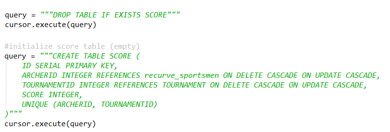

      Fig. 9: Creating the score table

In initialize_database function first if the table exists we drop it and than we create the table as new.

Display
^^^^^^^

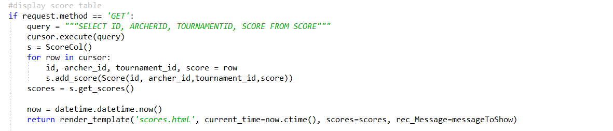

      Fig. 10: display for score table

To display the information we get the infromation scroe table with the select query. """SELECT ID, ARCHERID, TOURNAMENTID, SCORE FROM SCORE"""
Then we create the objects for each row. Then this object are sent to the page.

Delete
^^^^^^

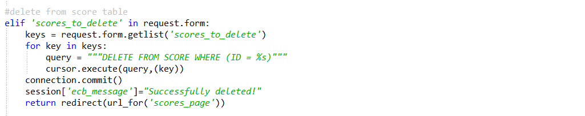

      Fig. 11: delete operation codes for score table

If any checkbox (for delete operation) is selected in the form we go through the database and delete the selected rows with the following query """DELETE FROM SCORE WHERE (ID = %s)""". %s is the key we took from the form. Then we redirect to the scores page.

Insert and Update
^^^^^^^^^^^^^^^^^

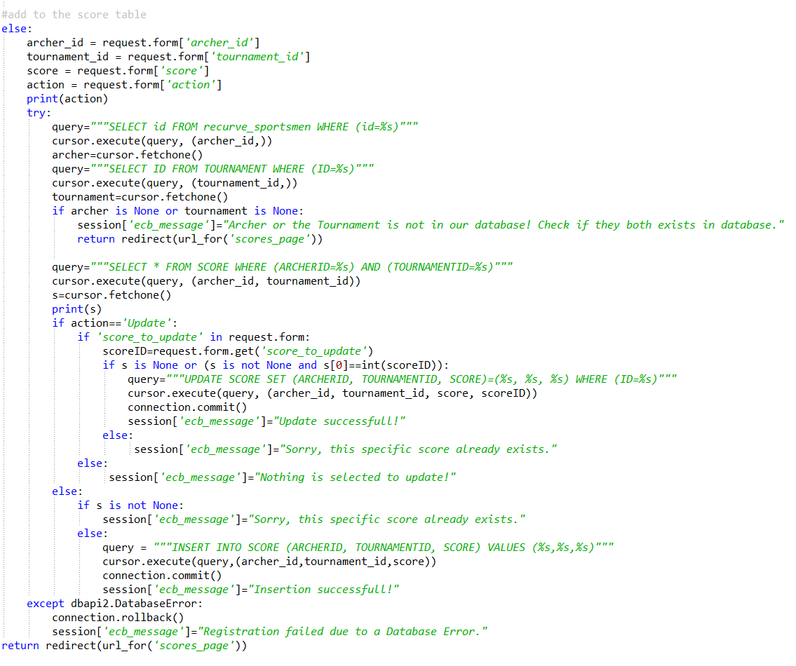

      Fig. 12: insert and update codes for score table

First we get the information from the html input tags. Then we look if the references exists. We look to the recurve_sportsmen table if archer_id exists and we look to the tournaments table if tournament_id exists. If one of the doesn't exists we change the error message to "Archer or the Tournament is not in our database! Check if they both exists in database." and redirect to the scores page.

If they both exist we look if this input exists in the score table. If it doesn't exists we look for the update request. When there is a update request we update with the """UPDATE SCORE SET (ARCHERID, TOURNAMENTID, SCORE)=(%s, %s, %s) WHERE (ID=%s)""" query. I not we insert with the """INSERT INTO SCORE (ARCHERID, TOURNAMENTID, SCORE) VALUES (%s,%s,%s)""" query. If the row exists in the score table we give the error message "Sorry, this specific score already exists." in these controls.

Then we have the exception handler. After that we redirect to the scores page.

