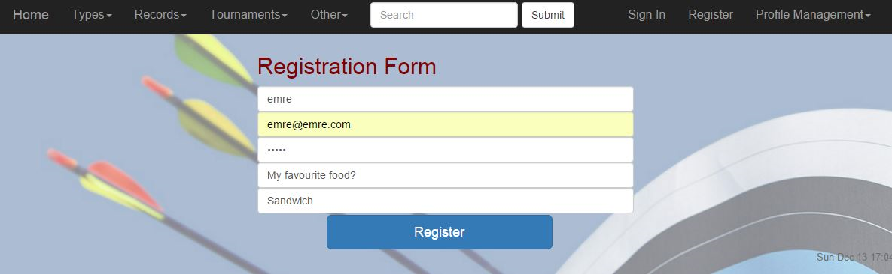
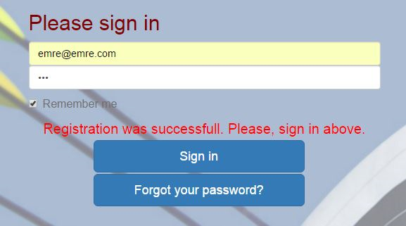
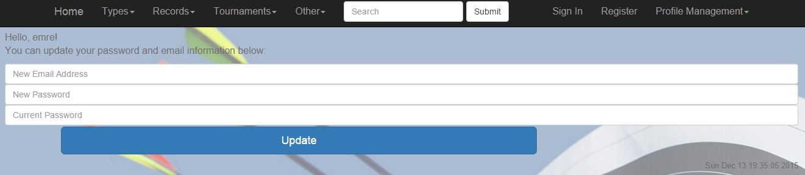
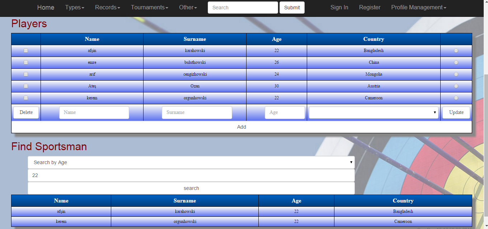
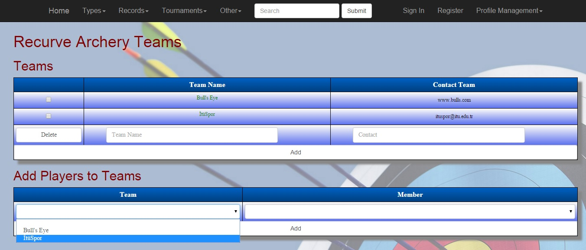
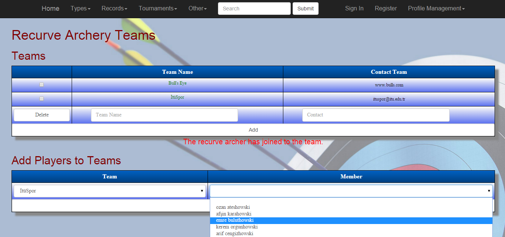
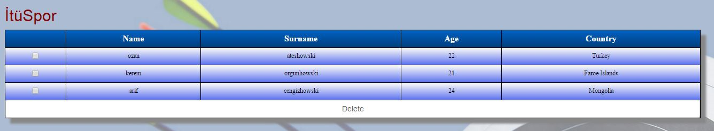

Parts Implemented by Emre Can Bulut
===================================
1. `User System`_
2. `Recurve Archery Page`_
3. `Recurve Archery Teams Page`_

User System
-----------
This is the system that covers user related pages and operations like registration, login, and profile management.

Register Page
^^^^^^^^^^^^^

In this page, a visitor could register to the website. All of the information asked in the registration form are required.

      Registration page view.

Once registered, the user will be redirected to the *Sign In* page.

Sign In Page
^^^^^^^^^^^^

This is the page where the user enters his/her e-mail address and password to login.

      Sign in page view.

My Profile
^^^^^^^^^^

In this page, users can update their e-mail address or password.

      My Profile page view.

Recurve Archery Page
--------------------

Recurve archers can be added to, updated in, or deleted from the table here. Also, there is another table at the bottom of the page to search recurve archers.

     Recurve Archery page view.

Add a Recurve Archer
^^^^^^^^^^^^^^^^^^^^

To add a recurve archer, go ahead and simply enter the name and the surname of the archer, enter an age value between 18-100, and pick a country where the archer is from in the dropdown list. Then, click on the add button.

Update a Recurve Archer
^^^^^^^^^^^^^^^^^^^^^^^

To update a recurve archer, first select the radio button on the rightmost column in the table that is in the same row with the archer you want to update. Then, enter the new information in the boxes. Then, click on the update button.

Delete a Recurve Archer
^^^^^^^^^^^^^^^^^^^^^^^

Delete operation can be done on multiple archers at once. Check the boxes on the leftmost column in the table that are in the same row with the archers you want to delete. Then, click on the delete button.

Find a Recurve Archer
^^^^^^^^^^^^^^^^^^^^^

Search operation is done using another table that is located at the bottom of the page. There are 3 options that you can search an archer by: name, surname, and age. Choose one of these options and enter a name, a surname, or an age. Then, click on the search button. Note that the search operation is case sensitive.

Recurve Archery Teams Page
--------------------------
In this page, recurve teams can be added to or deleted from the table. Also, recurve archers can be added to these teams. A team consists of 3 members. And, the same archer cannot be in different teams at the same time.

     Recurve Archery Teams page view.

Add a Recurve Archery Team
^^^^^^^^^^^^^^^^^^^^^^^^^^
In order to add a recurve archery team, enter the team name and a contact information like e-mail adress, phone number, or a web address etc. Then, click on the add button.

Delete a Recurve Archery Team
^^^^^^^^^^^^^^^^^^^^^^^^^^^^^
Delete operation can be done on multiple teams at once. Check the boxes on the leftmost column in the table that are in the same row with the teams you want to delete. Then, click on the delete button.

Add Players to Teams
^^^^^^^^^^^^^^^^^^^^
To add players to teams, use the table at the bottom of the page. First, select a team from the first dropdown list. Then, select a recurve archer from the second dropdown list. Finally, click on the add button.

     Adding players to teams.

Displaying Players in a Team
^^^^^^^^^^^^^^^^^^^^^^^^^^^^
To display a team and its members, simply click on the team name in the first table.

     Displaying players in a team.

Delete Players in a Team
^^^^^^^^^^^^^^^^^^^^^^^^
To delete a player from a team, first, display a team by clicking on the team name. Then, check the boxes on the leftmost column in the table that are in the same row with the archers you want to delete. Then, click on the delete button.
Note that, by doing so, you delete the archer only from the team. Information related to the archers who are deleted from a team can be found in `Recurve Archery Page`_. In order to delete a recurve archer from the system, you need to delete the archer
from the `Recurve Archery Page`_. If the archer you wish to update or delete is in a team, it will be updated or deleted from the team as well.