Parts Implemented by Ozan Ateş
==============================

1. `World Records Page`_
2. `Olympic Medalists Page`_
3. `Video Games Page`_

World Records Page
------------------

On this page, users can add, delete, update or search world records.

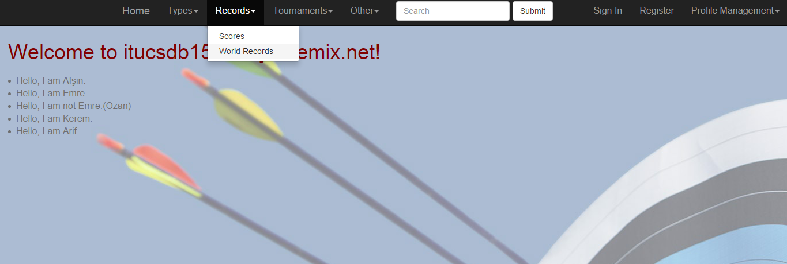

      Figure 1.1: Reaching to the World Records Page

World Records Page could be reached by selecting the category of Records on the top and clicking on World Records (See Figure 1.1).

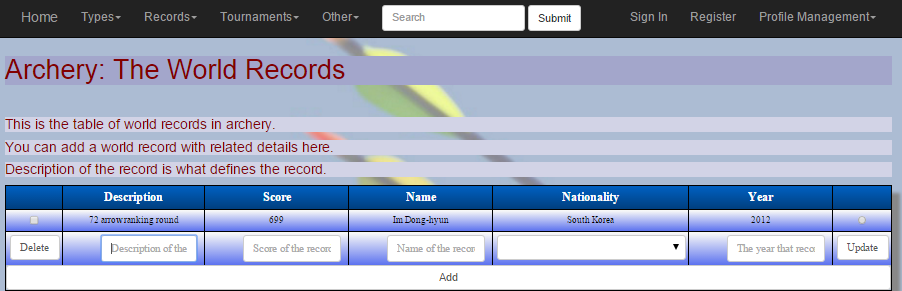

      Figure 1.2: World Records Page

Add operation
^^^^^^^^^^^^^
In order to add a world record to the table, user must enter the necessary information of the world record on the text boxes and then click to Add button (See Figure 1.3).

A world record consists of description of the record, score of the record, name of the record holder, nationality of the record holder and the year that record is set.
All information about a world record should be typed or selected in order to add it to the database. If some information is missing, web page simply shows a warning telling the user that it cannot be empty.
Nationality of the record holder must be selected from the dropdown list which lists all the countries that are located on the database as default.

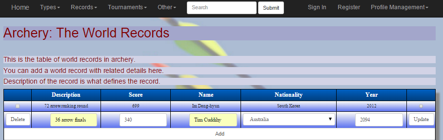

      Figure 1.3: Adding a world record

Year that record is held cannot be in the future. If user tries to add a year from the future, web page simply shows a warning telling the user that it cannot be added (See Figure 1.4).

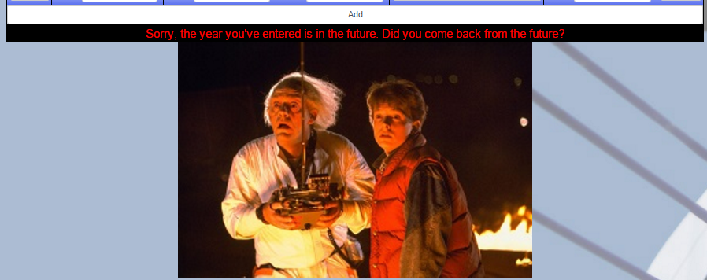

      Figure 1.4: Error for a future date

Update operation
^^^^^^^^^^^^^^^^

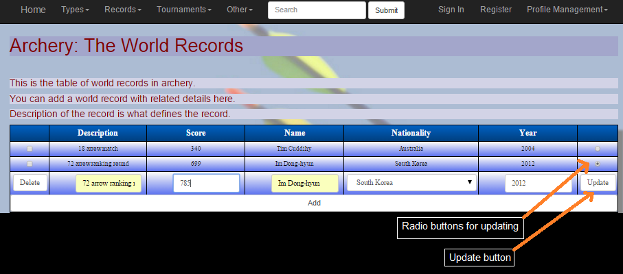

      Figure 1.5: Updating a world record

In order to update a world record on the table, user must select the related radio button on the right-hand side, enter the new information for the world record on the text boxes and then click to Update button (See Figure 1.5).

All constraints about add operation are also valid for update operation.
A world record consists of description of the record, score of the record, name of the record holder, nationality of the record holder and the year that record is set.
All information about a world record should be typed or selected in order to add it to the database. If some information is missing, web page simply shows a warning telling the user that it cannot be empty.
Nationality of the record holder must be selected from the dropdown list which lists all the countries that are located on the database as default.
Year that record is held cannot be in the future. If user tries to add a year from the future, web page simply shows a warning telling the user that it cannot be updated (See Figure 1.4).

Delete operation
^^^^^^^^^^^^^^^^

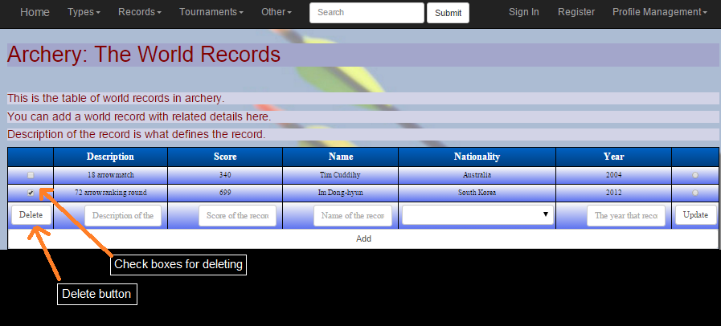

      Figure 1.6: Deleting a world record

In order to delete a world record from the table, user must select the related check box on the left-hand side and then click to Delete button (See Figure 1.6).

Search operation
^^^^^^^^^^^^^^^^

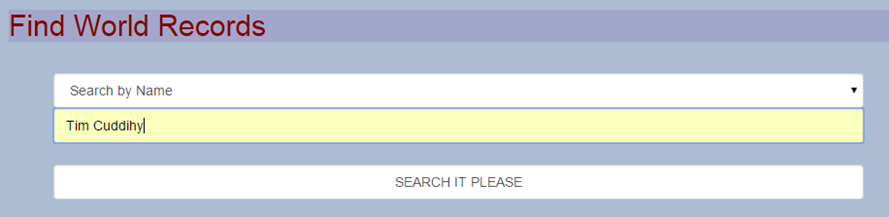

      Figure 1.7: Searching for world records

User can find world records in the table by scrolling down on the page and following the instructions below.

In order to search for world records from the table, user must select the attribute that is going to be filtered, enter the value to search and then click to SEARCH IT PLEASE button (See Figure 1.7).
Results will be listed in the table at the bottom of the page (See Figure 1.8).

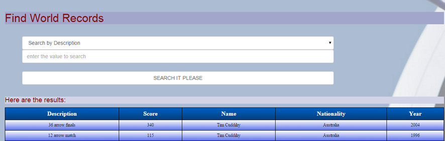

      Figure 1.8: Result of the search operation

Olympic Medalists Page
----------------------

On this page, users can add, delete, update or search olympic medalists.

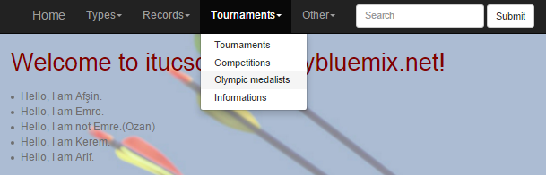

      Figure 2.1: Reaching to the Olympic Medalists Page

Olympic Medalists could be reached by selecting the category of Tournaments on the top and clicking on Olympic medalists (See Figure 2.1).

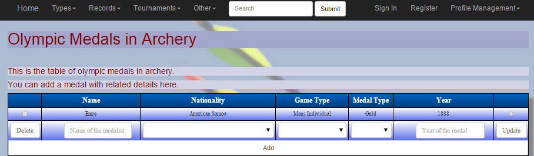

      Figure 2.2: Olympic Medalists Page

Add operation
^^^^^^^^^^^^^
In order to add an olympic medalist to the table, user must enter the necessary information of the medalist on the text boxes and then click to Add button (See Figure 2.3).

An olympic medalist consists of name of the medalist, nationality of the medalist, game type for that medal, medal type and the year that medal is claimed.
All information about an olympic medalist should be typed or selected in order to add it to the database. If some information is missing, web page simply shows a warning telling the user that it cannot be empty.
Nationality of the medalist, game type for that medal and medal type must be selected from the dropdown list which lists all the possible options that are located on the database as default.

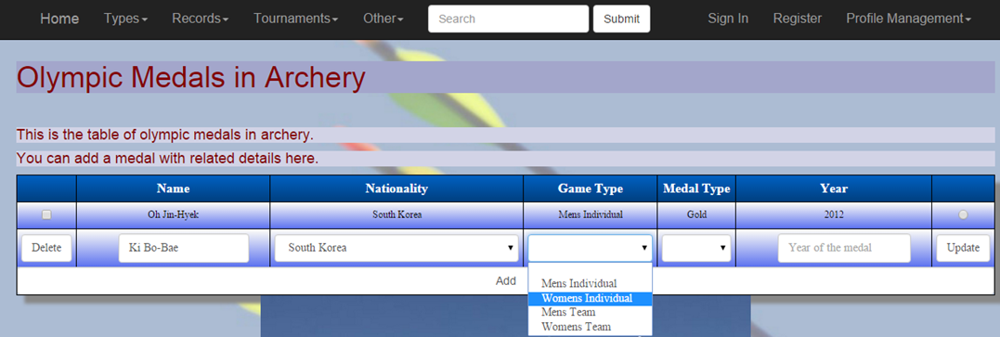

      Figure 2.3: Adding an olympic medalist

Year that medal is claimed cannot be in the future. If user tries to add a year from the future, web page simply shows a warning telling the user that it cannot be added (See Figure 2.4).

      Figure 2.4: Error for a future date

Update operation
^^^^^^^^^^^^^^^^

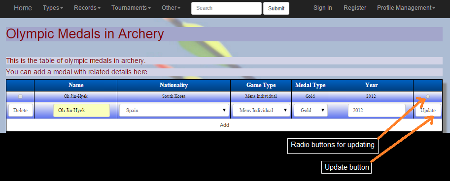

      Figure 2.5: Updating an olympic medalist

In order to update an olympic medalist on the table, user must select the related radio button on the right-hand side, enter the new information for the olympic medalist on the text boxes and then click to Update button (See Figure 2.5).

All constraints about add operation are also valid for update operation.
An olympic medalist consists of name of the medalist, nationality of the medalist, game type for that medal, medal type and the year that medal is claimed.
All information about an olympic medalist should be typed or selected in order to add it to the database. If some information is missing, web page simply shows a warning telling the user that it cannot be empty.
Nationality of the medalist, game type for that medal and medal type must be selected from the dropdown list which lists all the possible options that are located on the database as default.
Year that medal is claimed cannot be in the future. If user tries to add a year from the future, web page simply shows a warning telling the user that it cannot be added (See Figure 2.4).

Delete operation
^^^^^^^^^^^^^^^^

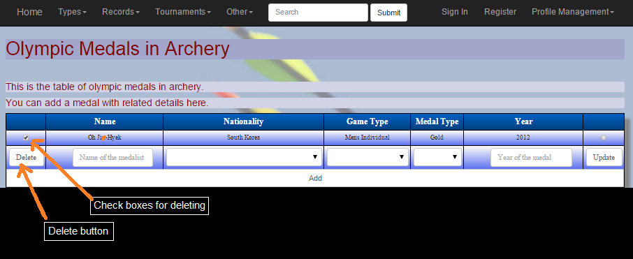

      Figure 2.6: Deleting an olympic medalist

In order to delete an olympic medalist from the table, user must select the related check box on the left-hand side and then click to Delete button (See Figure 2.6).

Search operation
^^^^^^^^^^^^^^^^

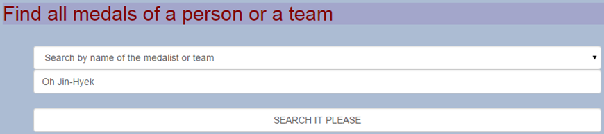

      Figure 2.7: Searching for olympic medalists

User can find olympic medalists in the table by scrolling down on the page and following the instructions below.

In order to search for olympic medalists from the table, user must select the attribute that is going to be filtered, enter the value to search and then click to SEARCH IT PLEASE button (See Figure 2.7).
Results will be listed in the table at the bottom of the page (See Figure 2.8).

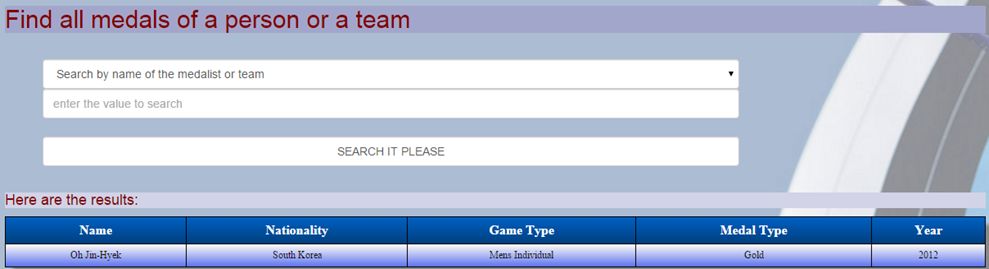

      Figure 2.8: Result of the search operation

Video Games Page
----------------

On this page, users can add, delete, update or search video games.

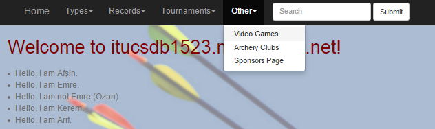

      Figure 3.1: Reaching to the Video Games Page

Video Games Page could be reached by selecting the category of Other on the top and clicking on Video Games (See Figure 3.1).

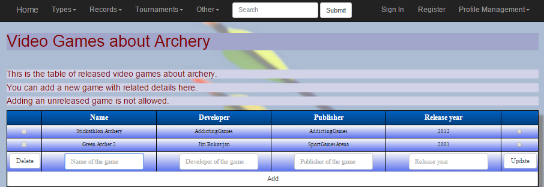

      Figure 3.2: Video Games Page

Add operation
^^^^^^^^^^^^^
In order to add a video game to the table, user must enter the necessary information of the video game on the text boxes and then click to Add button (See Figure 3.3).

A video game consists of name of the game, developer of the game, publisher of the game and release year of the game.
All information about a video game should be typed or selected in order to add it to the database. If some information is missing, web page simply shows a warning telling the user that it cannot be empty.

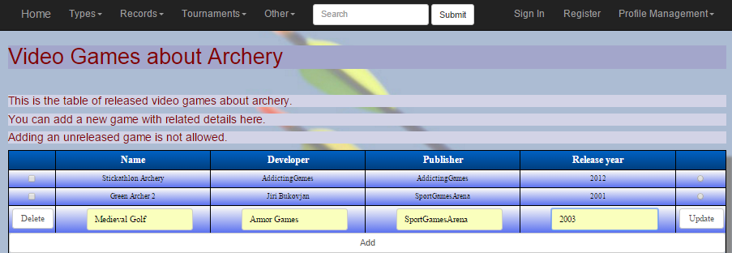

      Figure 3.3: Adding a video game

Release year of the game cannot be in the future. If user tries to add a year from the future, web page simply shows a warning telling the user that it cannot be added (See Figure 3.4).

      Figure 3.4: Error for a future date

Update operation
^^^^^^^^^^^^^^^^

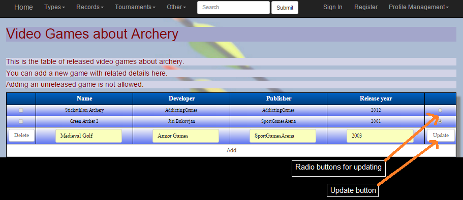

      Figure 3.5: Updating a video game

In order to update a video game on the table, user must select the related radio button on the right-hand side, enter the new information for the video game on the text boxes and then click to Update button (See Figure 3.5).

All constraints about add operation are also valid for update operation.
A video game consists of name of the game, developer of the game, publisher of the game and release year of the game.
All information about a video game should be typed or selected in order to add it to the database. If some information is missing, web page simply shows a warning telling the user that it cannot be empty.
Release year of the game cannot be in the future. If user tries to add a year from the future, web page simply shows a warning telling the user that it cannot be added (See Figure 3.4).

Delete operation
^^^^^^^^^^^^^^^^

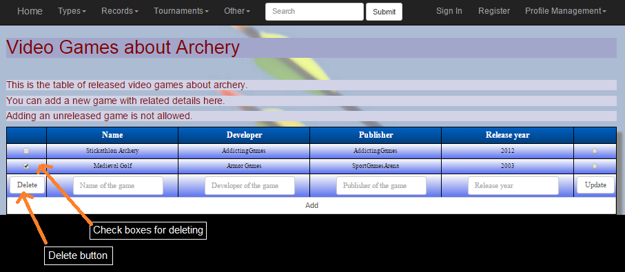

      Figure 3.6: Deleting a video game

In order to delete a video game from the table, user must select the related check box on the left-hand side and then click to Delete button (See Figure 3.6).

Search operation
^^^^^^^^^^^^^^^^

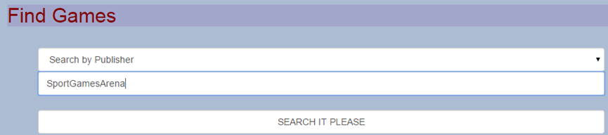

      Figure 3.7: Searching for video games

User can find video games in the table by scrolling down on the page and following the instructions below.

In order to search for video games from the table, user must select the attribute that is going to be filtered, enter the value to search and then click to SEARCH IT PLEASE button (See Figure 3.7).
Results will be listed in the table at the bottom of the page (See Figure 3.8).

      Figure 3.8: Result of the search operation