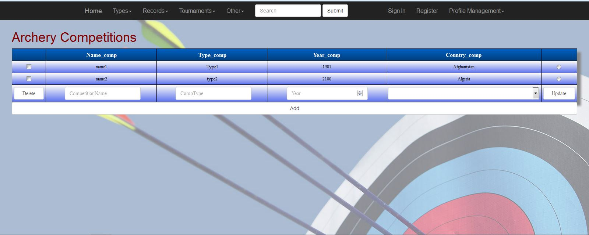
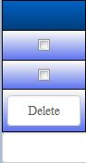
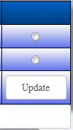
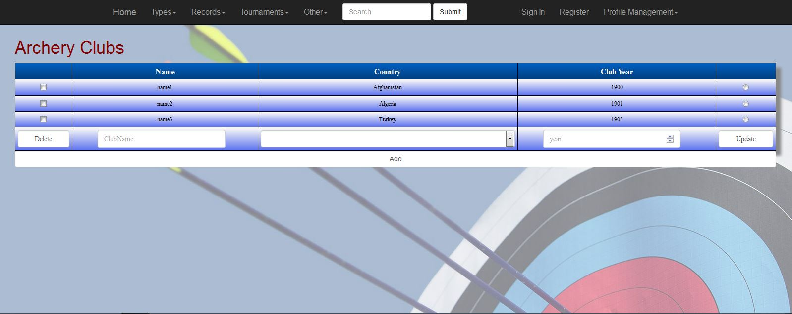

Parts Implemented by Mehmet Arif Cengiz
=======================================

User Manual of Pages
********************
1. `Competitions Page`_
2. `Archery Clubs Page`_
3. `Informations Page`_

Competitions Page
-----------------
Competitions page is located at Tournaments dropdown table in home page.

      Competitions page

Add Operation
^^^^^^^^^^^^^

Users want to add a competition in the page should fill all the blanks on the table that are competition name, type, year and country. Year should be between 1900 and 2100. Country is selected in the dropdown in table. After clicking add button new record will be added.

Delete Operation
^^^^^^^^^^^^^^^^

      Delete checkbox

Users want to delete competition should check the checkbox seen on Figure 2 that is on the left handside of records. If users want to delete more than one record, multiple checking is permitted. After checking checkboxes, user should click the delete button to delete records.

Update Operation
^^^^^^^^^^^^^^^^

      Udate radiobox

Users wants to update competition record should click the radio button seen on the Figure 3 that is on the right handside of records. With checking radiobox user should fill all the blanks with updated versions of informations. After that, user should click the update button to update record.

Archery Clubs Page
------------------

Archery Clubs page is located at Other dropdown table in home page.

      Archery Clubs page

Add Operation
^^^^^^^^^^^^^

Users want to add a club in the page should fill all the blanks on the table that are club name, year and country. Year should be between 1900 and 2100. Country is selected in the dropdown in table. After clicking add button new record will be added.

Delete Operation
^^^^^^^^^^^^^^^^

      Delete checkbox

Users want to delete club should check the checkbox seen on Figure 5 that is on the left handside of records. If users want to delete more than one record, multiple checking is permitted. After checking checkboxes, user should click the delete button to delete records.

Update Operation
^^^^^^^^^^^^^^^^

      Udate radiobox

Users wants to update club record should click the radio button seen on the Figure 6 that is on the right handside of records. With checking radiobox user should fill all the blanks with updated versions of informations. After that, user should click the update button to update record.

Informations Page
-----------------

Informations page is located at Tournaments dropdown table in home page.

      Informations page

Add Operation
^^^^^^^^^^^^^

Users want to add a information in the page should fill all the blanks on the table that are tournament name, olympic name, year and informations about tournaments. Year should be between 1900 and 2100. After clicking add button new record will be added.

Delete Operation
^^^^^^^^^^^^^^^^

      Delete checkbox

Users want to delete informations should check the checkbox seen on Figure 8 that is on the left handside of records. If users want to delete more than one record, multiple checking is permitted. After checking checkboxes, user should click the delete button to delete records.

Update Operation
^^^^^^^^^^^^^^^^

      Udate radiobox

Users wants to update informations record should click the radio button seen on the Figure 9 that is on the right handside of records. With checking radiobox user should fill all the blanks with updated versions of informations. After that, user should click the update button to update record.

