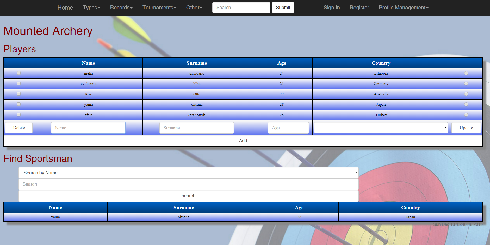
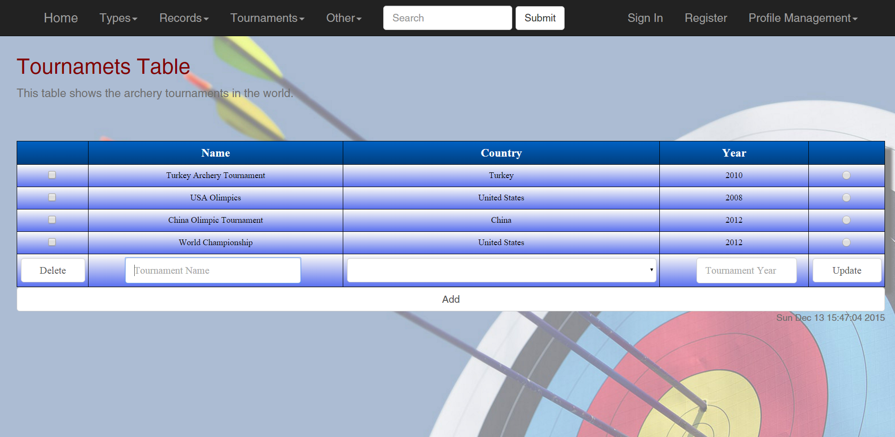
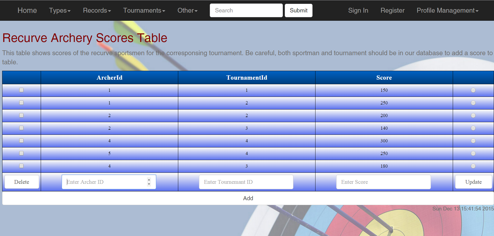

Parts Implemented by Muhammet Afşin Karataş
===========================================

Mounted Archers Page
--------------------
This page is for displaying the mounted sportsmen table. Basic operations (add, delete, update, find) for the mounted sportmen table are performed in this page.

      Fig. 1: Mounted arhers page view.

Add operation
^^^^^^^^^^^^^
To add a sportsman to the table, enter the information of the sportsman and click the add button. Age parameter must be bigger than 18. If a sportsmen already exists in the database an error message will be printed to the page. You can pick the country of the sportsman from the dropdown list on the country column.

Delete operation
^^^^^^^^^^^^^^^^
To delete a sportsman from the table, select the proper checkbox from the left and click the delete button. After you delete the player page will be refreshed and you will see a message informing you about the result of the operation.

Update operation
^^^^^^^^^^^^^^^^
To update a sportsman info, enter the information, select the proper radiobox from the right and click the update button. If the information you entered matches any other entry in the table you will seea message that tell the sportsman already exists inthe table. If not the update operation will be performed and you will see a message about the result of the operation. 

Find operation
^^^^^^^^^^^^^^
To find the info of a sportsman, select the attribute you want to search by and enter the info you want to search. Click the search button and info of the matching sportsmen will be shown below. You can select the attribute you want to search from, from provided dropdown list.

Tournaments Page
----------------
This page is for displaying the tournaments table. Basic operations (add, delete, update) for the tournaments table are performed in this page.

      Fig. 2: Tournaments page view.

Add operation
^^^^^^^^^^^^^
To add a tournament to the table enter the information of the tournament and click the add button. Tournament year cannot past the current year. You can select the country thatthe tournament will take place, from the dropdown list in the country column. If the tournament information already exists in the table you will be informed about that and the operation will not be performed. But if it is not in the table, torunament will be added to the table and you will see a message about the result of the operation. 

Delete operation
^^^^^^^^^^^^^^^^
To delete a tournament from table select the proper checkbox on the left and click the delete button. When you delete a tournament, the score information about that tournament will be deleted too in the score table.

Update operation
^^^^^^^^^^^^^^^^
To update a tournament info in the table,  enter the info, select the proper radiobox fro right and click the update button. Same restrictions about entering the info to the input boxes holds here too. If you enter an existing tournament information, update operation will not be performed and you will see a message about that. If it doesn't match with any other tournament infothe tournament you selected will be updated.

Recurve Scores Page
-------------------
This page is for displaying the scores table for the recurve archers. Basic operations (add, delete, update) for the scores table are performed in this page.

      Fig. 3: Recurve scores page view.

Add operation
^^^^^^^^^^^^^
To add a score to the table, enter the needed information and click the add button. Both the archer and the tournament should be in the database beforehand. If they are not in the database you will see an error message about that. If the score for the archer and tournament combination is already added to the table you will see a message says that the specific score for this archer is already addedto the table. In this can if you want to change this specific score you may want to use the update operation. 

Delete operation
^^^^^^^^^^^^^^^^
To delete a score from the table select the proper checkbox from the left and click the delete button. After you delete a score page will be refreshed and you will see a message about the result of the operation.

Update operation
^^^^^^^^^^^^^^^^
To update a score in the table, enter the needed information, select the proper radiobox from the right and click the update button. Same things in the add operation holds here too. If you try to add an existing score you will get an error message. If either archer or the tournament doesn't exists in the database you will get an error message saying they don't exists. If you enter the information properly you will get a message about the result of the operation.
