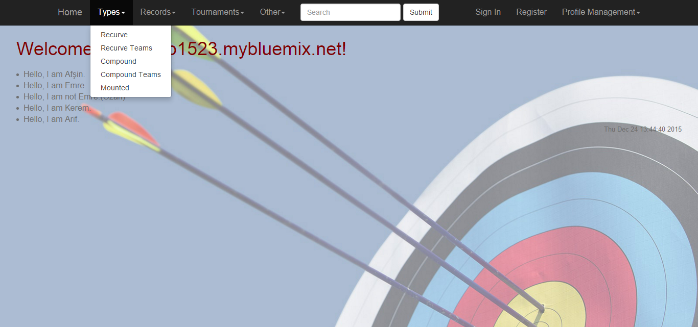
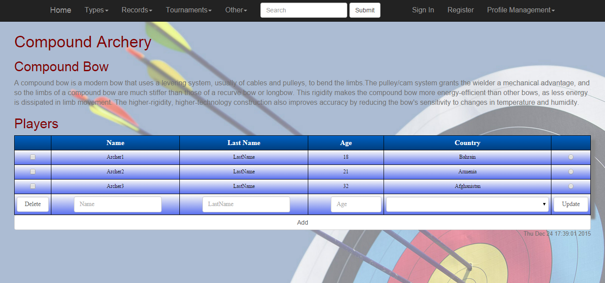
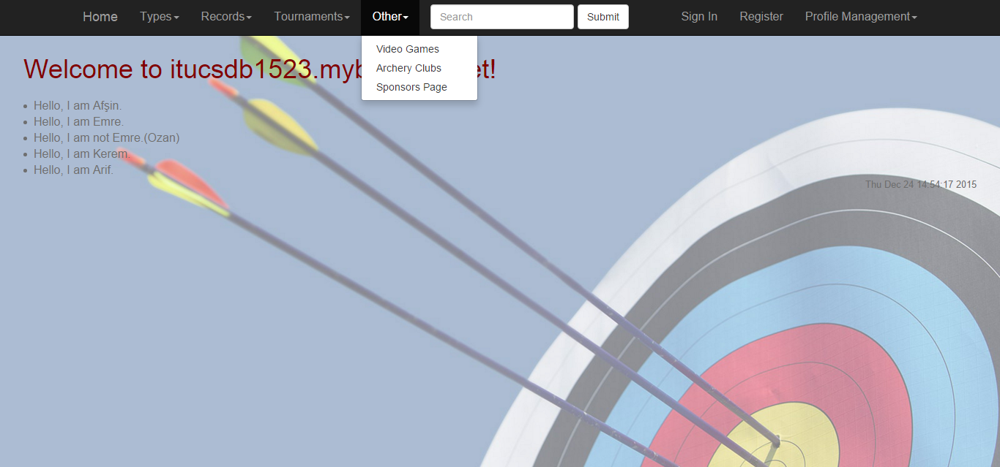
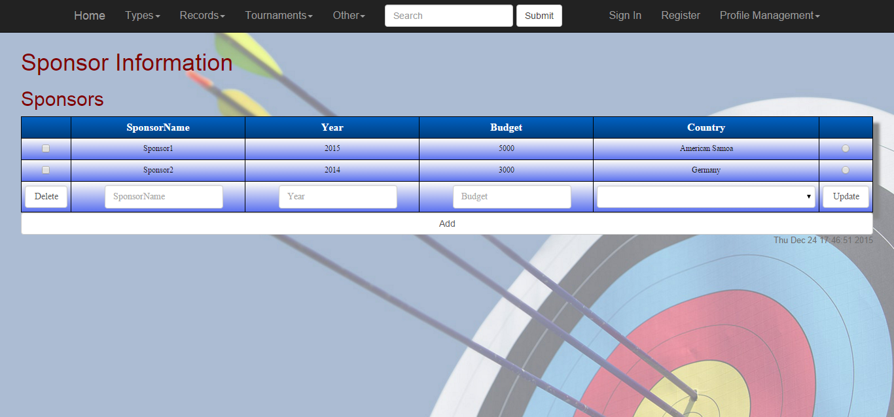
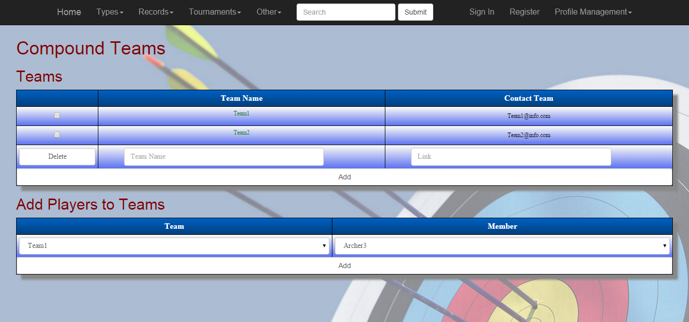
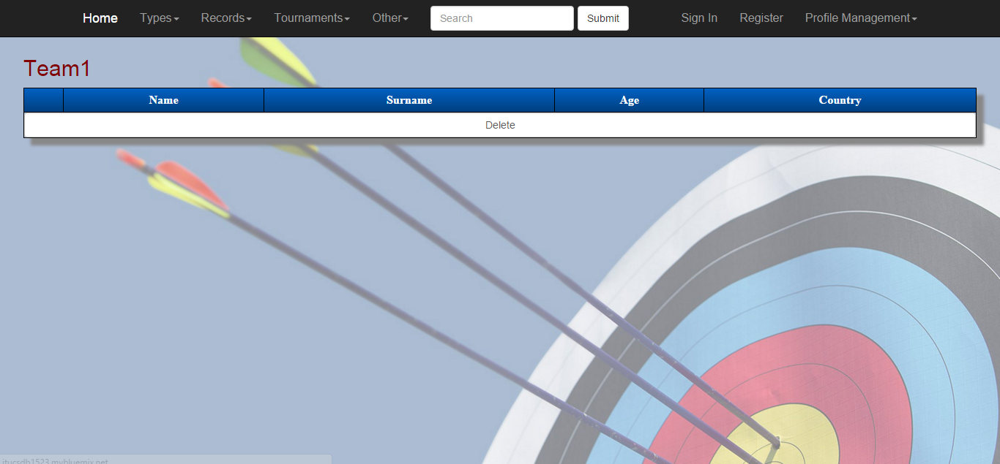

Parts Implemented by Emre Kerem ORGUN
=====================================

1. `Compound Archers Page`_
2. `Sponsors Page`_
3. `Compound Team Page`_

Compound Archers Page
---------------------

On this page users can add, delete, update and display compound bow sportsmen.

      Compound arhers page's Dropdown look.

      Compound arhers page.

Add operation
^^^^^^^^^^^^^
In order to add a compound sportsman to the table,user must enter the name, lastname, age and country informations of that
sporstman and then click to add button. Age parameter must be between 18 and 100. Also while selecting country for sportsmen,
when the user click on the space, all existing countries are displayed.User just needs to select the country.
One another significant thing is that, user have to enter all data otherwise a message comes to the screen that says that
it is an obligation to fill all informations.

Delete operation
^^^^^^^^^^^^^^^^
In order to delete a compound sportsman from the table, user must select the related checkbox, and click on the delete button below.
Also user can delete multiple sportsmen at one time by selecting more than one sportsmen then clicking delete button.

.. figure:: images/delete.JPG
      :scale: 100 %
      :alt: delete checkboxes

      Delete Checkboxes.

Update operation
^^^^^^^^^^^^^^^^
In order to update a compound sportsman information,after entering the new information, user must select the related radiobox
from the right and click the update button.

.. figure:: images/delete.JPG
      :scale: 100 %
      :alt: update checkboxes

      Update Checkboxes.

Sponsors Page
-------------

On this page users can add, delete, update and display Sponsors.

      Sponsors page's Dropdown look

      Sponsors table.

Add operation
^^^^^^^^^^^^^
In order to add a Sponsor to the table,user must enter the sponsors name, the sponsorship year, bugdet amount as Lira and country informations of that
sponsor and then click to add button. Year parameter must be bigger than 1900. Also while selecting country for sponsor,
when the user click on the space, all existing countries are displayed.User just needs to select the country.
One another significant thing is that, user have to enter all data otherwise a message comes to the screen that says that
it is an obligation to fill all informations.

Delete operation
^^^^^^^^^^^^^^^^
In order to delete a sponsor from the table, user must select the related checkbox, and click on the delete button below.
Also user can delete multiple sponsors at one time by selecting more than one sponsors then clicking delete button.

Update operation
^^^^^^^^^^^^^^^^
In order to update a sponsor information,after entering the new information, user must select the related radiobox
 from the right and click the update button.

Compound Team Page
------------------

On this page users can add, delete, update and display Compound Teams. Also user can add compound sportsmen to the teams.
However, this speciality does not work unfortunately.

      Compound Teams Table

Add operation
^^^^^^^^^^^^^
In order to add a Compound Team to the table,user must enter the team name and contact information of that
team and then click to add button.Also user have to enter all data otherwise a message comes to the screen that says that
it is an obligation to fill all informations.After adding a team, in order to see the team members and delete the members
from team, the user needs to click on the team's name. This page below is opened.

      Single Team Table

Delete operation
^^^^^^^^^^^^^^^^
In order to delete a team from the table, user must select the related checkbox, and click on the delete button below.
Also user can delete multiple teams at one time by selecting more than one teams then clicking delete button.

Update operation
^^^^^^^^^^^^^^^^
In order to update a team information,after entering the new information, user must select the related radiobox
from the right and click the update button.
